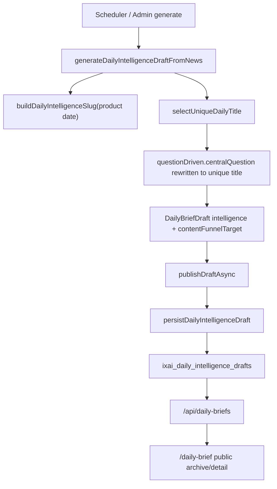
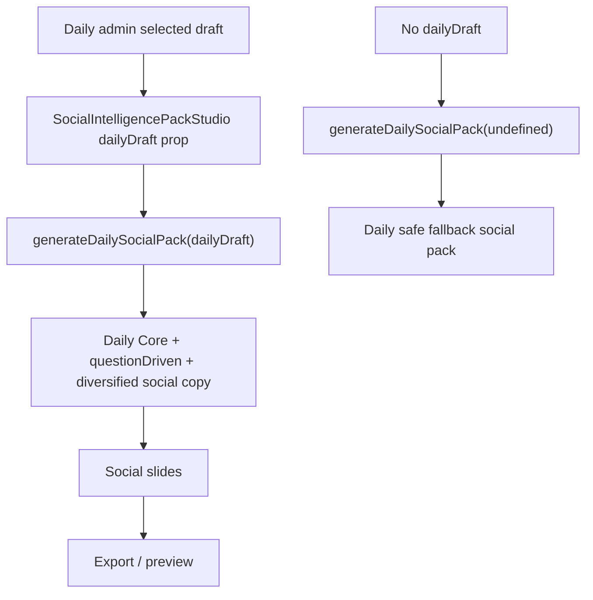
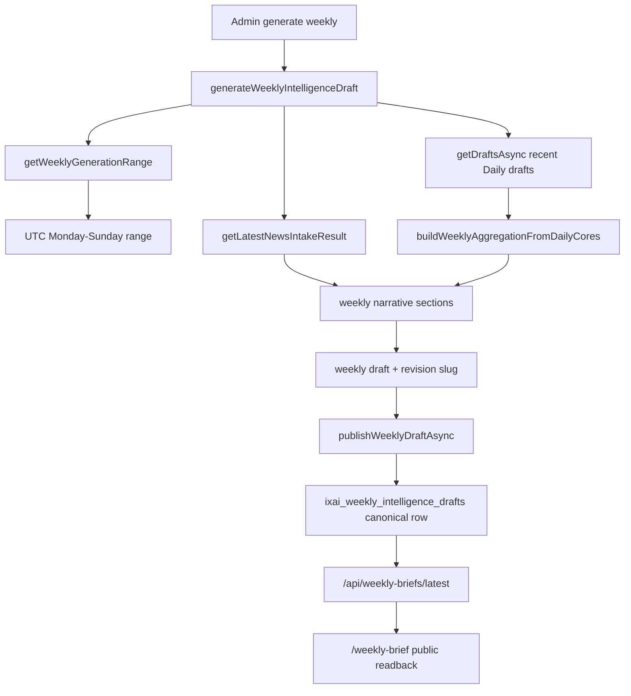
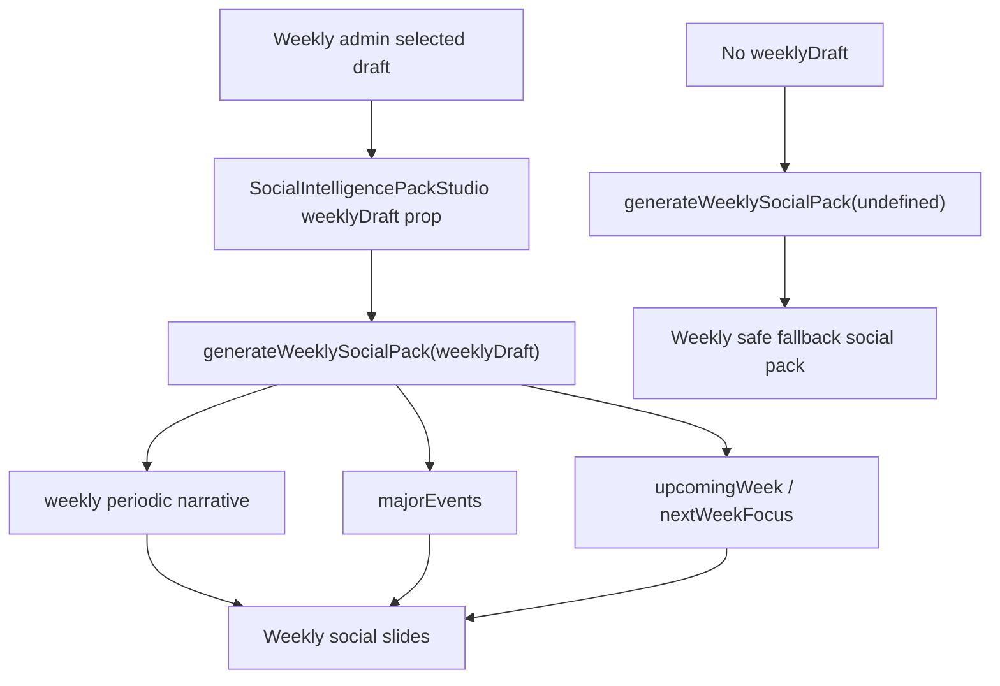

# IXAI Content Pipeline Incident Audit — 2026-06-07

## Incident Summary

On 2026-06-07, the IXAI content pipeline showed cross-period content mismatch symptoms:

- Daily Brief generated and published normally.
- Daily Social Pack generated, but the Social Pack text did not match the Daily Brief narrative.
- Weekly Brief appeared stuck on `2026-06-01 ~ 2026-06-07`.
- Weekly Social Pack text appeared closer to the Daily Brief narrative than the Weekly Brief.
- The likely failure area is not the content model alone. The higher-risk area is source selection across Daily, Weekly, Social Pack preview/export, slug/date-range readback, and fallback generation.

This audit is investigation-only. No product code was changed.

## User-Observed Symptoms

1. Daily Brief exists and is readable.
2. Daily Social Pack exists, but copy does not align with Daily Brief content.
3. Weekly Brief still shows the range `2026-06-01 ~ 2026-06-07`.
4. Weekly Social Pack appears to match Daily content more than Weekly content.
5. Daily / Weekly brief and Social Pack generation targets may be crossed, stale, or falling back to the wrong source.

## Files Audited

Documentation reviewed:

- `docs/PROJECT_CONTEXT.md`
- `docs/PROJECT_RULES.md`
- `docs/ROADMAP.md`
- `docs/VERSION_HISTORY.md`
- `docs/CONTENT_ENGINE_V162_PLAN.md`
- `docs/CONTENT_ENGINE_ARCHITECTURE.md`
- `docs/CONTENT_ENGINE_REWRITE_V162.md`
- `docs/DAILY_BRIEF_ROOT_CAUSE_ANALYSIS.md`
- `docs/PROVIDER_HEALTH_REVIEW.md`
- `docs/PRO_DASHBOARD_READBACK_V1805.md`
- `docs/V1807_INTEGRATION_VALIDATION.md`
- `docs/V1808_STAGING_VALIDATION.md`

Daily / Weekly / Social Pack files audited:

- `src/lib/editorial/persistence.ts`
- `src/lib/editorial/repository.ts`
- `src/lib/editorial/scheduler.ts`
- `src/lib/editorial/product-date.ts`
- `src/lib/editorial/weekly.ts`
- `src/lib/intelligence/generator.ts`
- `src/lib/intelligence/social/social-intelligence-pack.ts`
- `components/admin/daily-briefs-admin.tsx`
- `components/admin/social-intelligence-pack-studio.tsx`
- `app/api/daily-briefs/route.ts`
- `app/api/weekly-briefs/latest/route.ts`
- `app/api/weekly-briefs/[slug]/route.ts`
- `app/api/admin/weekly-briefs/generate/route.ts`
- `app/api/admin/weekly-briefs/[id]/publish/route.ts`
- `app/api/admin/weekly-briefs/[id]/route.ts`
- `app/daily-brief/page.tsx`
- `app/daily-brief/[slug]/page.tsx`
- `components/daily-brief/daily-brief-unified-archive.tsx`
- `components/daily-brief/daily-brief-local-detail.tsx`

Keyword search included:

- `daily-intelligence`
- `weekly-intelligence`
- `social pack`
- `socialPack`
- `daily social`
- `weekly social`
- `week_start`
- `week_end`
- `slug`
- `published`
- `generateDaily`
- `generateWeekly`
- `SocialPack`
- `DailyCore`
- `Weekly`
- `canonical`
- `revision`
- `period`
- `todaySignal`
- `questionDriven`
- `contentFunnelTarget`

## Production Readback Snapshot

Public API checks against `https://app.ixuan.ai` showed:

Daily latest:

- API: `/api/daily-briefs`
- Latest slug: `daily-intelligence-2026-06-07`
- Latest title: `台股週一恐迎史詩級修正，台指期夜盤狂瀉逾3000點引發市場震盪`
- Status: `published`
- Published at: `2026-06-07T02:20:56.216+00:00`
- Daily `contentFunnelTarget`: `/daily-brief/daily-intelligence-2026-06-07`

Weekly latest:

- API: `/api/weekly-briefs/latest`
- Latest slug: `weekly-intelligence-2026-06-07-r3`
- Title: `IXAI Weekly Intelligence｜2026-06-01 - 2026-06-07`
- Coverage: `2026-06-01 – 2026-06-07`
- Upcoming period: `2026-06-08 – 2026-06-14`
- Published at: `2026-06-01T16:55:31.589+00:00`
- Notable issue: base slug `/api/weekly-briefs/weekly-intelligence-2026-06-07` returns `not_found`; the canonical public slug includes revision suffix `-r3`.

## Daily Generation Flow Map

Confirmed:

- Daily product date uses `Asia/Taipei` through `src/lib/editorial/product-date.ts`.
- Daily generated slug uses the product date key, for example `daily-intelligence-2026-06-07`.
- Daily public archive fetches `/api/daily-briefs` client-side and falls back to static only when no published intelligence exists.
- Daily detail first checks persisted Supabase content by slug, then falls back to static content.

Risk:

- `src/lib/editorial/repository.ts` merges persisted Supabase rows with local/static fallback data in admin/server contexts. If an admin-selected draft is not the intended persisted daily row, Social Pack generation can use a non-production source.
- `src/lib/editorial/persistence.ts` persists `source_status: []`, which removes provider diagnostic detail after persistence. This does not directly cause mismatch, but weakens post-incident traceability.

## Daily Social Pack Flow Map

Confirmed:

- Daily Social Pack is generated by `generateDailySocialPack(source?: DailyBriefDraft | null)`.
- If a valid Daily draft is passed, the pack uses Daily Core, Daily `questionDriven`, and Daily `contentFunnelTarget`.
- If no Daily draft is passed, the generator still returns a Daily fallback pack. That fallback has no `sourceBriefId`.

Important risk:

- `components/admin/social-intelligence-pack-studio.tsx` always computes both Daily and Weekly packs:
  - `dailyPack = generateDailySocialPack(dailyDraft)`
  - `weeklyPack = generateWeeklySocialPack(weeklyDraft)`
- The same studio renders both period buttons even when only one source exists.
- In a Weekly-only context, switching to Daily creates a Daily fallback pack with no Daily source.
- In a Daily-only context, switching to Weekly creates a Weekly fallback pack with no Weekly source.

This is the strongest confirmed source-alignment risk for Social Pack mismatch.

## Weekly Generation Flow Map

Confirmed:

- Weekly range is computed by `getWeeklyGenerationRange(now)` as Monday through Sunday.
- On Sunday 2026-06-07, the code-defined current weekly range is expected to be `2026-06-01 – 2026-06-07`.
- Weekly generation still uses recent Daily drafts for aggregation via `buildWeeklyAggregationFromDailyCores(recentDailyBriefs)`, even though v1.62 docs require Weekly not to become Daily aggregation with a weekly label.
- With revision schema available, weekly slugs are revisioned, for example `weekly-intelligence-2026-06-07-r3`.
- Public latest weekly uses canonical published rows ordered by `published_at.desc.nullslast`.

Risks:

- User-visible "stuck on 2026-06-01 ~ 2026-06-07" is not necessarily a generation failure on 2026-06-07. It matches current code's weekly date range.
- The production latest weekly row has a revision slug `-r3`, but `publishedAt` remains `2026-06-01T16:55:31.589+00:00`. The code path should refresh `publishedAt` during publish, so this needs database-row verification.
- Base slug `weekly-intelligence-2026-06-07` returns `not_found` because the public canonical slug is `weekly-intelligence-2026-06-07-r3`. Any share/export code that guesses the base slug will point to missing content.

## Weekly Social Pack Flow Map

Confirmed:

- Weekly Social Pack is generated by `generateWeeklySocialPack(source?: WeeklyIntelligenceDraft | null)`.
- If a valid Weekly draft is passed, it uses Weekly-only fields:
  - `sections.periodicNarrative`
  - `sections.insight`
  - `sections.majorEvents`
  - `sections.upcomingWeek`
  - `sections.nextWeekFocus`
- If no Weekly draft is passed, the generator still returns a Weekly fallback pack.
- Current generator code does not directly call `generateDailySocialPack` from the Weekly function.

Risks:

- Admin UI allows Weekly Social Pack generation when no Weekly source is present.
- Weekly generation itself still imports recent Daily drafts as part of the Weekly aggregation layer, so Weekly copy can remain Daily-like even when the Social Pack generator uses the Weekly draft correctly.
- If the selected Weekly draft is stale canonical data, Weekly Social Pack will be generated from stale weekly data.

## Cross-Period Mismatch Audit

Confirmed:

- Daily Social Pack source ID should be `source.id` from a `DailyBriefDraft`.
- Weekly Social Pack source ID should be `source.id` from a `WeeklyIntelligenceDraft`.
- The Social Pack generator itself has separate Daily and Weekly entry points.
- `contentFunnelTarget` differs by period when a source exists:
  - Daily: `/daily-brief/${source.slug}`
  - Weekly: `/weekly-brief/${source.slug}`

Confirmed risk:

- `SocialIntelligencePackStudio` does not enforce that the active period has a matching source object.
- Both Daily and Weekly generation buttons are visible in the shared studio even when one source prop is absent.
- The generator's fallback path can make a pack look "generated" even though it was not generated from a selected Daily or Weekly row.

Not confirmed:

- No direct evidence was found that `generateWeeklySocialPack()` calls the Daily Social Pack generator.
- No direct evidence was found that Daily and Weekly Social Packs share a global cached content object.
- No direct evidence was found that localStorage/sessionStorage stores Social Pack drafts in the audited generator.

## Database / Supabase Readback Audit

Daily:

- Table: `ixai_daily_intelligence_drafts`.
- Public route: `/api/daily-briefs`.
- Published filtering: `status = published`.
- Latest ordering: `published_at.desc.nullslast, updated_at.desc`.
- Public readback is slug-aware for detail pages.

Weekly:

- Table: `ixai_weekly_intelligence_drafts`.
- Public latest route: `/api/weekly-briefs/latest`.
- With revision schema, latest published readback requires `status = published` and `is_canonical = true`.
- Ordering uses `published_at.desc.nullslast`.
- Detail readback by slug requires exact canonical slug when revision schema is present.

Risks:

- Weekly `published_at` in production appears stale relative to revision slug `-r3`.
- Weekly base slug without revision suffix 404s.
- If admin/share/export assumes non-revision slug, public weekly detail will fail.
- If multiple canonical rows exist due to manual database state, latest readback may select the wrong row.

## Suspected Root Causes Ranked

### 1. Social Pack Studio allows cross-period fallback generation

Likelihood: High

Evidence:

- The studio always computes both Daily and Weekly packs.
- Each admin desk generally passes only one source type.
- Missing source still produces a fallback pack.
- This can make an exported pack appear valid while not being tied to the selected Daily or Weekly row.

Impact:

- Daily Social Pack can appear not to match Daily Brief.
- Weekly Social Pack can appear source-misaligned if generated from fallback or stale selected row.

### 2. Weekly range is expected to remain 2026-06-01 – 2026-06-07 on 2026-06-07

Likelihood: High

Evidence:

- `getWeeklyGenerationRange()` defines weekly range as Monday through Sunday.
- On 2026-06-07, `2026-06-01 – 2026-06-07` is the current week, not inherently stale.

Impact:

- The observed weekly range alone does not prove failed weekly generation.
- The stale-looking issue is more likely due to revision/publishedAt/canonical row state or user expectation of next-week generation before the current week closes.

### 3. Weekly latest canonical row has stale `publishedAt`

Likelihood: Medium-high

Evidence:

- Production `/api/weekly-briefs/latest` returns slug `weekly-intelligence-2026-06-07-r3`.
- It also returns `publishedAt: 2026-06-01T16:55:31.589+00:00`.
- `publishWeeklyDraftAsync()` should set `publishedAt` to current publish time.

Impact:

- UI can appear stuck even if content or revision slug changed.
- Latest selection can be misleading if multiple canonical rows or stale publish timestamps exist.

### 4. Weekly revision slug mismatch

Likelihood: Medium

Evidence:

- Latest canonical slug is `weekly-intelligence-2026-06-07-r3`.
- Base slug `weekly-intelligence-2026-06-07` returns `not_found`.

Impact:

- Any code or manual share that guesses the base slug will fail or point to a stale/default page.

### 5. Weekly source still depends partly on Daily aggregation

Likelihood: Medium

Evidence:

- Weekly generation calls `getDraftsAsync()` and `buildWeeklyAggregationFromDailyCores(recentDailyBriefs)`.
- v1.62 docs explicitly warn that Weekly must not become Daily aggregation with a weekly label.

Impact:

- Weekly narrative and Weekly Social Pack can feel Daily-like even without period parameter bugs.

### 6. Daily admin source list can include merged fallback/static rows

Likelihood: Low-medium

Evidence:

- `getDraftsAsync()` merges persisted drafts with local/static drafts.
- Social Pack generation depends on the selected admin draft.

Impact:

- Admin could preview/export from a selected row that is not the current published Daily.

## What Is Confirmed

- Daily public latest generated and published for 2026-06-07.
- Weekly latest public row is `weekly-intelligence-2026-06-07-r3`, not the base slug.
- Weekly range `2026-06-01 – 2026-06-07` is expected on 2026-06-07 under current weekly range logic.
- Daily and Weekly Social Pack generators are separate functions.
- The shared Social Pack Studio can generate a pack for a period with no matching source object.
- Missing source paths return fallback Social Packs instead of blocking export/preview.

## What Is Not Confirmed

- It is not confirmed that Daily Social Pack directly used Weekly content.
- It is not confirmed that Weekly Social Pack directly called Daily Social Pack generator.
- It is not confirmed that Social Packs are persisted to a separate Supabase table.
- It is not confirmed that a localStorage Social Pack draft caused the mismatch.
- It is not confirmed that Weekly generation failed; the date range observed is current-week behavior.
- It is not confirmed why production weekly `publishedAt` is stale without inspecting Supabase rows directly.

## Safe Fix Plan

Recommended next version:

`v1.82.0 — Daily / Weekly Social Pack Source Alignment Fix`

Safe fix scope:

1. Add hard period/source guard in `SocialIntelligencePackStudio`.
   - Daily pack export/preview requires a Daily source draft.
   - Weekly pack export/preview requires a Weekly source draft.
   - Disable the opposite period button when the matching source is absent.
   - Display explicit source ID, slug, period, and published date before export.

2. Add generator-level source assertions or QA warnings.
   - Fallback pack may still exist for emergency use.
   - Admin export should not silently export fallback when a source draft is expected.

3. Add a Social Pack source diagnostic panel.
   - Period: Daily / Weekly.
   - Source ID.
   - Source slug.
   - Source date or week range.
   - CTA target.
   - Fallback status.

4. Validate weekly canonical readback.
   - Add admin/API diagnostic showing canonical weekly slug, revision, `publishedAt`, `weekStart`, `weekEnd`, and `isCanonical`.
   - Confirm only one canonical published row per week.
   - Do not apply migrations without separate approval.

5. Add tests.
   - Daily studio cannot export Weekly fallback without Weekly source.
   - Weekly studio cannot export Daily fallback without Daily source.
   - Weekly social pack CTA uses exact revision slug.
   - Public weekly base slug mismatch is visible in diagnostics.

## No-Touch Areas

This incident should not modify:

- v1.80 / v1.81 Portfolio, FCN, Stock, Crypto files
- Auth / SSO / Pro launch
- Backend account-link
- LINE / LIFF
- Stripe / billing
- Supabase migration
- Provider ingestion logic
- Daily / Weekly content generation model unless a separate v1.82 implementation explicitly scopes it

## Go / No-Go

Go for a scoped v1.82 source-alignment implementation.

Do not mix this with v1.81 Portfolio Input UI work.

Do not attempt a full content-engine rewrite as the first fix. The highest-confidence issue is source selection and fallback export safety in the admin Social Pack workflow.
