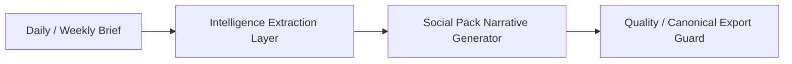

# v1.83.0 — Intelligence Extraction Layer

## Problem summary

v1.82.7 upgraded the Social Pack generator into a stronger strategist narrative format, but the generator still had to read thin Daily / Weekly Brief fields directly and decide both what the source means and how to render each card.

That created recurring quality risks:

- Weak source fields could still collapse into generic statements.
- Weekly Social Pack could lose the cross-market chain from the Weekly Brief.
- AI / Tech cards could drift into macro or crypto language when the source was thin.
- FCN content could remain educational (`KO / KI` definitions) instead of translating market events into FCN risk context.
- The generator had too much responsibility: source extraction, fallback selection, card composition, caption generation, and export eligibility.

## Root cause

Brief-to-Social mapping did not have a separate intelligence extraction contract. Daily / Weekly Briefs were converted into Social Pack cards directly, so source thinness affected the final cards immediately.

The missing layer was:

## New extraction architecture

New module:

- `src/lib/intelligence/social/brief-intelligence-extractor.ts`

The extractor is responsible for turning Daily / Weekly source drafts into structured social intelligence before cards are composed.

The Social Pack generator now prefers extraction results for:

- cover questions
- market evidence
- cross-market chain
- catalysts
- risk translation
- FCN translation
- I-Xuan view angle

The quality guard remains responsible for preventing weak output from formal export.

## Daily extraction contract

Daily extraction returns:

- `centralQuestion`
- `coreThesis`
- `keyAnswer`
- `evidenceItems[]`
- `counterEvidenceItems[]`
- `watchNextItems[]`
- `riskRegime`
- `fcnTranslation`
- `iXuanViewAngle`

Daily Social Pack target cards:

1. 今日市場核心問題
2. What The Market Sees: Macro / AI-Tech / Taiwan-Crypto
3. Risk Regime: risk state + trigger + FCN translation
4. Watch Next: 24-72 hour concrete observations
5. I-Xuan View: opinionated, non-generic market view

## Weekly extraction contract

Weekly extraction returns:

- `centralQuestion`
- `coreThesis`
- `weeklyChange`
- `crossMarketChain[]`
- `evidenceItems[]`
- `nextWeekCatalysts[]`
- `aiEarningsPowerSignal`
- `fcnTranslation`
- `iXuanWeeklyViewAngle`

Weekly cross-market chain:

- Fed / Rates
- USD
- AI Beta
- Taiwan Semis
- Crypto
- FCN Volatility

Weekly Social Pack target cards:

1. 本週核心市場衝突
2. Fed / USD / AI Beta / Taiwan Semis / Crypto / FCN chain
3. AI / Tech Watch with earnings, guidance, capex, and Taiwan AI supply chain
4. Next Week Catalysts with concrete events
5. I-Xuan Weekly View with market view, risk view, next-week watch, and FCN translation

## FCN translation upgrade

FCN content should not stop at explaining `KO / KI`.

The extraction layer translates market events into:

- worst-of basket pressure
- volatility context
- KO probability context without promising probability
- KI risk awareness
- basket concentration sensitivity

The system must not generate personalized investment advice, target prices, trade instructions, guaranteed returns, or automatic allocation guidance.

## Modified files

- `src/lib/intelligence/social/brief-intelligence-extractor.ts`
- `src/lib/intelligence/social/social-intelligence-pack.ts`

## Before / after examples

Before:

- `Market Pulse / Market Pulse`
- `本週市場重點在事件下週催化`
- `這不是新聞數量，而是市場定價正在改變`
- AI / Tech card could discuss BTC / ETH or pure macro.
- FCN card could only explain KO / KI terms.

After:

- Daily cards use extracted `centralQuestion`, `evidenceItems`, `riskRegime`, `watchNextItems`, and `iXuanViewAngle`.
- Weekly cards use extracted `crossMarketChain`, `nextWeekCatalysts`, `aiEarningsPowerSignal`, and `fcnTranslation`.
- Thin source fallback uses concrete anchors such as FOMC / Powell, AI guidance, 台積電 / 2330, BTC / ETH, and FCN volatility.
- The generator no longer emits the known banned phrases as primary card content.

## QA checklist

- Daily Social Pack does not show `Market Pulse / Market Pulse`.
- Daily Watch Next does not show `Watch 1 / Watch 2 / Watch 3`.
- Weekly Market Review includes the cross-market chain.
- Weekly AI / Tech Watch includes AI earnings, guidance, capex, or Taiwan AI supply chain anchors.
- Weekly Next Week Catalysts contains at least three concrete catalysts.
- FCN content translates market events into worst-of / volatility / KO / KI / basket concentration context.
- v1.82 quality guard still blocks placeholder, generic fallback, review/non-canonical weekly, and fallback-only official export.

## Rollback plan

If v1.83 output quality regresses, revert:

- `src/lib/intelligence/social/brief-intelligence-extractor.ts`
- the import and extraction-driven mapping in `src/lib/intelligence/social/social-intelligence-pack.ts`

No schema, auth, SSO, backend, or portfolio files are involved.

## Known limitations

- The extractor still depends on the available Daily / Weekly draft fields. If the source is extremely thin, it uses anchored fallback language rather than inventing facts.
- It does not call a new LLM extraction step.
- It does not modify Daily / Weekly Brief generation.
- It does not repair public readback or Supabase canonical data issues.

## Next step

Recommended next version:

- `v1.84.0 — Strategist Layer`

v1.84 should decide whether extraction should become a scored, auditable object stored with each Social Pack draft, and whether human editorial review should approve extracted thesis / evidence / FCN translation before export.
