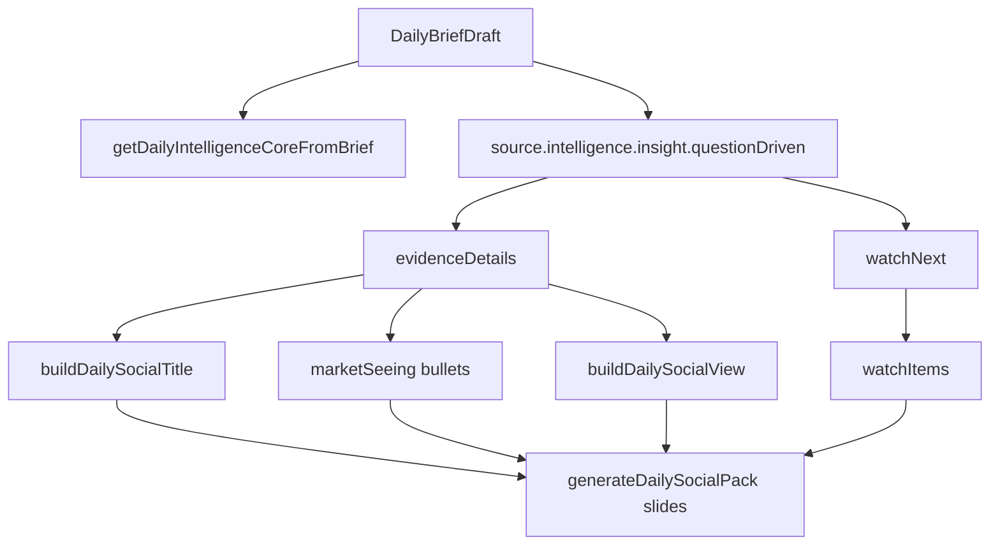
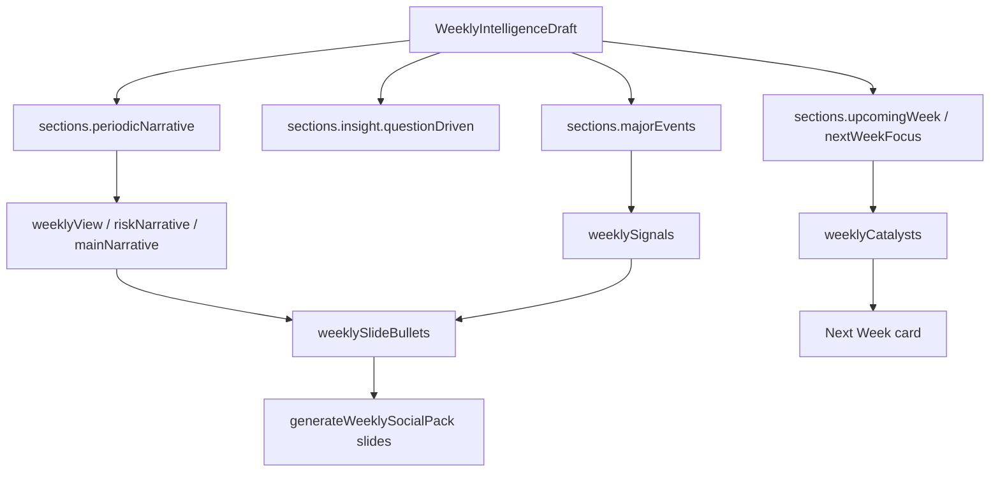

# v1.82.5 — Narrative Intelligence Rewrite Audit

## 1. Problem summary

v1.82.0 to v1.82.4 already fixed Social Pack source alignment, weekly canonical export eligibility, and export quality blocking. Those guards correctly prevent low-quality packs from becoming formal exports, but they do not solve the upstream narrative problem.

The current Daily / Weekly Social Pack generator can still produce weak or mismatched content before the export guard catches it:

- Daily Social Pack can include editor placeholder language such as `具體事件待 editor 審閱。`
- Daily Watch Next can render structural labels such as `Watch 1`, `Watch 2`, `Watch 3`.
- Daily I-Xuan View can repeat the same subject twice and create awkward logic.
- Weekly AI / Tech card can discuss BTC / ETH or macro risk instead of AI / Tech.
- Weekly Next Week Catalysts can fall back to generic wording and repeat itself.
- Weekly Social Pack does not reliably preserve the Weekly Brief's cross-market chain, FOMC catalyst, or FCN awareness.
- Public Daily Brief slug readback can show a loading state or fail independently from Social Pack generation.

Conclusion: v1.82.4 is a necessary export safety layer. v1.82.5 implementation must rewrite the Social Pack narrative mapping contract so bad cards are not generated in the first place.

## 2. Files audited

Required docs read:

- `docs/PROJECT_CONTEXT.md`
- `docs/PROJECT_RULES.md`
- `docs/PROJECT_MAP.md`
- `docs/IXAI_VISION.md`
- `docs/PRODUCT_ORIGIN.md`
- `docs/ROADMAP.md`
- `docs/VERSION_HISTORY.md`
- `docs/SOCIAL_PACK_CONTENT_QUALITY_GUARD_V1824.md`
- `docs/WEEKLY_SOCIAL_PACK_CANONICAL_EXPORT_GUARD_V1823.md`
- `docs/WEEKLY_SOCIAL_PACK_REVISION_ALIGNMENT_AUDIT_V1822.md`

Code audited:

- `src/lib/intelligence/social/social-intelligence-pack.ts`
- `src/lib/intelligence/social/layout-rules.ts`
- `src/lib/intelligence/periodic/periodic-narrative.ts`
- `src/lib/intelligence/insight/build-social-funnel.ts`
- `src/lib/intelligence/insight/build-insight.ts`
- `src/lib/intelligence/generator.ts`
- `components/admin/social-intelligence-pack-studio.tsx`
- `app/daily-brief/[slug]/page.tsx`
- `components/daily-brief/daily-brief-local-detail.tsx`
- `app/api/daily-briefs/route.ts`
- `src/lib/editorial/repository.ts`

## 3. Current Daily Social Pack generation flow

Current flow:



Key observations:

- Daily Social Pack depends heavily on `questionDriven.evidenceDetails`.
- If evidence event text is missing or mostly English, the generator inserts fallback text.
- `marketSeeing` maps evidence directly into card bullets and uses `具體事件待 editor 審閱。` as a fallback.
- `watchItems` always prefixes generated observations with `Watch ${index + 1}`.
- `buildDailySocialView()` creates a sentence from the first two evidence subjects. If both subjects collapse to the same label, the I-Xuan View repeats itself.
- Captions are fixed templates and do not prove that the slides carry source-specific insight.

## 4. Current Weekly Social Pack generation flow

Current flow:



Key observations:

- Weekly Social Pack uses `periodicNarrative`, `majorEvents`, `upcomingWeek`, `nextWeekFocus`, and `questionDriven` but does not enforce a card-level source contract.
- The AI / Tech card uses `weeklySlideBullets[2]` plus `riskLine`, so a macro or crypto risk sentence can appear under the AI / Tech heading.
- The Next Week Catalysts card uses `weeklyCatalysts`, but fallback logic may supply generic next-week copy rather than three concrete catalysts.
- Weekly Social Pack has no dedicated mapping for cross-market chain, such as Fed/rates -> USD -> US AI beta -> Taiwan semis -> Crypto -> FCN volatility.
- Weekly Social Pack has no required FCN awareness output, even when the Weekly Brief carries risk/FCN implications.

## 5. Root cause list

### Root cause 1 — Placeholder text lives inside the generator

The string `具體事件待 editor 審閱。` is not only a QA artifact. It is an explicit fallback in `src/lib/intelligence/social/social-intelligence-pack.ts`.

Impact:

- Daily Social Pack can generate a visually complete card while carrying editor-pending text.
- v1.82.4 blocks export, but preview still exposes the weak generator output.

### Root cause 2 — Structural labels are treated as content

Daily Watch Next currently maps observations as:

```ts
`Watch ${index + 1}｜${readableSnippet(...)}`
```

Impact:

- Rendered cards can show `Watch 1`, `Watch 2`, `Watch 3` as if they are editorial headings.
- This makes the pack feel like a template rather than a finished social narrative.

### Root cause 3 — Daily I-Xuan View builds from subjects, not validated insight

`buildDailySocialView()` derives `subject` and `second` from the first two evidence items. If both map to the same subject, the output can repeat:

`今天先看 企業 AI 採用 ... 再看 企業 AI 採用 ...`

Impact:

- Card 5 can contain repeated phrases and weak logic even when the Daily Brief itself is more coherent.

### Root cause 4 — Weekly card identity is not contract-bound

The Weekly AI / Tech card does not require AI / semiconductor / cloud / capex / guidance content. It can receive `riskLine` from macro or crypto risk.

Impact:

- A card titled AI / Tech Watch can discuss BTC / ETH or macro pricing.
- This creates title/content mismatch and reduces trust.

### Root cause 5 — Weekly next-week catalysts are not enforced as concrete events

Weekly `weeklyCatalysts` falls back to generic topic-level lines when `upcomingWeek` or `nextWeekFocus` are missing or weak.

Impact:

- Card 4 can become a generic observation instead of a next-week catalyst card.
- Repeated sentence risk increases because `ensureDistinctNarratives()` can still choose fallback-level abstractions.

### Root cause 6 — Weekly cross-market chain is not a first-class field

The Weekly Brief can contain a meaningful chain such as rates / macro pricing, AI earnings power, Taiwan semis, crypto risk, and FCN volatility. The Social Pack generator does not have a required structure to preserve that chain.

Impact:

- Weekly Social Pack loses the Weekly Brief's most important synthesis.
- It becomes a simplified headline pack rather than a high-quality conversion layer into the full Weekly Brief.

### Root cause 7 — Export guards and narrative generation are disconnected

v1.82.4 detects content quality after the pack is generated. The generator has no native `contractStatus`, `missingRequiredFields`, or `qualityIssues` output.

Impact:

- Admin can preview bad content, and the reason for weakness is detected late.
- The next implementation should make narrative generation produce contract-aware metadata.

### Root cause 8 — Daily public readback is likely an independent issue

The public route `app/daily-brief/[slug]/page.tsx` server-checks persisted content but renders `DailyBriefLocalDetail`, a client component that fetches `/api/daily-briefs?slug=...` again. The observed production page for `daily-intelligence-2026-06-08` stayed at `正在讀取每日簡報。`

Important correction:

- The correct API path is `/api/daily-briefs?slug=<slug>`, not `/api/daily-briefs/<slug>`.

Likely readback risks:

- Client fetch or hydration can fail while the server already knows the persisted brief exists.
- The component has no timeout or visible error state for a fetch that never resolves.
- Repository fallback behavior may differ depending on whether Supabase persisted rows exist.

This should be split into a separate readback fix unless the v1.82.5 implementation directly needs it for Social Pack QA.

## 6. Placeholder source audit

Confirmed placeholder / fallback sources:

- `evidenceSocialPoint()` fallback: `等待 editor 補充具體事件與來源。`
- `evidenceSocialPoint()` event fallback: `具體事件待 editor 審閱。`
- Daily `marketSeeing` event fallback: `具體事件待 editor 審閱。`
- Daily `watchItems` label prefix: `Watch ${index + 1}`
- Weekly fallback signals: `本週事件｜週內主要事件尚待 editor 補充...`
- Daily/Weekly captions: fixed templates that do not reflect actual slide completeness.

Current normalization weakens generic terms but does not ban all weak output at generation time. For example, `normalizeSocialCopy()` transforms some generic phrases but does not prevent placeholders from entering slide data.

## 7. Daily Narrative Contract

Daily Social Pack must have exactly this editorial structure:

### Card 1 — 今日市場核心問題

Question:

`今天市場到底在交易什麼？`

Requirements:

- Must be derived from the Daily Brief's concrete headline, central question, or top evidence.
- Must include at least one concrete theme: Macro, AI-Tech, Taiwan, Crypto, FCN/risk, rates, or company/event.
- Must not be a generic market slogan.

### Card 2 — What The Market Sees

Must include three axes:

- Macro
- AI-Tech
- Taiwan-Crypto

Requirements:

- Each axis must have actual source content.
- No editor-pending text.
- No empty category placeholder.
- If an axis lacks source, the generator should mark the pack as not formally exportable rather than inventing a fake bullet.

### Card 3 — Risk Regime

Must include:

- Risk State
- Why It Matters
- FCN Awareness

Requirements:

- Risk State can be clear / watch / elevated, but must be explained.
- Why It Matters must connect market condition to risk tolerance.
- FCN Awareness must use KO / KI / Worst-of / volatility / basket logic where relevant.
- Must not become investment advice.

### Card 4 — Watch Next

Must include:

- True 24-72 hour observations.
- At least three concrete watch items.

Requirements:

- No `Watch 1`, `Watch 2`, `Watch 3` labels.
- Each item should include a market variable, event, asset, company, data point, or time window.

### Card 5 — I-Xuan View

Requirements:

- 80-150 Chinese characters.
- Must have a clear point of view.
- Must not merely summarize the pack.
- Must not repeat the same short phrase or subject twice unless intentionally contrasting two dimensions.
- Must end with a reason to read the full Daily Brief.

## 8. Weekly Narrative Contract

Weekly Social Pack must have exactly this editorial structure:

### Card 1 — 本週市場核心問題

Requirements:

- Must identify the main weekly question.
- Must derive from published canonical Weekly Brief source.
- Must not be only a sensational headline.

### Card 2 — What Changed This Week

Must include:

- Macro
- AI
- Market

Requirements:

- Each item must describe what changed during the week.
- Must not be a Daily x 7 summary.
- Should preserve the public Weekly Brief's core market chain.

### Card 3 — The One Thing That Matters

Requirements:

- One dominant weekly axis.
- If titled AI / Tech, content must include AI / semiconductor / NVDA / 台積電 / TSMC / capex / guidance / cloud / data center.
- If the dominant axis is macro, title should say macro/rates rather than AI / Tech.

### Card 4 — Next Week Catalysts

Requirements:

- At least three concrete catalysts.
- At least one catalyst should come from a specific event/data/company/asset/date where source permits.
- Examples: FOMC, Powell, CPI, PCE, 財報, guidance, 指引, 台積電, 2330, QQQ, SPY, BTC.
- No repeated generic sentence.

### Card 5 — I-Xuan Weekly View

Must include:

- Market view.
- Risk view.
- Next-week observation direction.

Requirements:

- Must preserve the Weekly Brief's cross-market chain.
- Should include FCN awareness when weekly risk context involves volatility, basket risk, KO/KI distance, or worst-of risk.
- Must not be a generic quote card.

## 9. Zero tolerance terms

These strings must never enter formal Social Pack generator output:

- `Watch1`
- `Watch2`
- `Watch3`
- `Watch 1`
- `Watch 2`
- `Watch 3`
- `placeholder`
- `editor pending`
- `TBD`
- `TODO`
- `coming soon`
- `具體事件待 editor 審閱`
- `請先審閱`
- `待 editor`
- `editor 審閱`

## 10. Generic narrative ban

The following sentence patterns may not appear by themselves. They are allowed only when attached to a concrete event, asset, date, company, data point, or catalyst:

- `市場持續關注`
- `值得觀察`
- `市場訊號正在轉向`
- `投資人持續觀察`
- `風險偏好受到壓力`
- `事件背後的市場訊號`
- `AI敘事仍有吸引力`

Implementation should treat these as generation-time blockers, not only export-time warnings.

## 11. Proposed implementation plan

### Step 1 — Add contract-level builders

Add explicit internal builders in `src/lib/intelligence/social/social-intelligence-pack.ts`:

- `buildDailyNarrativeContract(source)`
- `buildWeeklyNarrativeContract(source)`

Each builder should return:

- `cards`
- `requiredFields`
- `missingFields`
- `qualityIssues`
- `exportEligible`
- `sourceMapping`

The generator should no longer produce finished slide copy from loose fallback arrays alone.

### Step 2 — Replace placeholder fallbacks with blocked-state metadata

Do not insert `具體事件待 editor 審閱。` or `Watch 1` into slide text.

If a required Daily or Weekly field is missing:

- Preview may show a clearly marked admin-only diagnostic message.
- Formal pack output should be `exportEligible: false`.
- Export controls should continue to block download/copy/export.

### Step 3 — Daily contract mapping

Map source fields into the fixed Daily structure:

- Daily core question from `questionDriven.centralQuestion`, top evidence, or Daily title.
- Macro / AI-Tech / Taiwan-Crypto axes from evidence categories and intelligence watch sections.
- Risk Regime from `riskRegimeReasoning`, `fcnAwareness`, and counter-evidence.
- Watch Next from `questionDriven.watchNext`, `investorWatchpoints`, and dated/source-specific catalysts.
- I-Xuan View from `questionDriven.ixuanView` only if it passes repetition and length checks; otherwise synthesize from top concrete evidence without duplicated subject.

### Step 4 — Weekly contract mapping

Map source fields into the fixed Weekly structure:

- Core question from canonical Weekly title, `periodicNarrative.socialHook`, or `majorEvents`.
- What Changed from `intelligenceSummary.whatChanged`, `majorEvents`, and periodic themes.
- One Thing That Matters from dominant theme with title/content alignment.
- Next Week Catalysts from `upcomingWeek`, `nextWeekFocus`, and question-driven watch items, requiring at least three concrete catalysts.
- I-Xuan Weekly View from `periodicNarrative.ixuanView`, preserving cross-market chain and FCN awareness.

### Step 5 — Add title/content consistency checks

Daily and Weekly builders should validate:

- AI / Tech card must contain AI / semiconductor / cloud / guidance / capex terms.
- FCN / Risk card must contain KO / KI / worst-of / volatility / basket or equivalent risk education terms.
- Next Week Catalysts must contain concrete catalysts.

### Step 6 — Make captions source-specific

Replace fixed captions with source-aware captions:

- Daily caption should mention the core question, one market axis, one risk point, and the full Daily CTA.
- Weekly caption should mention the weekly question, one changed market structure, next-week catalysts, and the full Weekly CTA.

### Step 7 — QA and regression coverage

Add targeted tests or a deterministic QA checklist for:

- No zero-tolerance terms.
- No repeated sentences.
- Weekly AI / Tech title/content alignment.
- Weekly catalyst concreteness.
- Daily I-Xuan View repetition avoidance.
- Daily / Weekly source metadata intact.

## 12. Exact files likely to modify

Likely v1.82.5 implementation files:

- `src/lib/intelligence/social/social-intelligence-pack.ts`
- `src/lib/intelligence/social/layout-rules.ts`
- `components/admin/social-intelligence-pack-studio.tsx`

Possible supporting files if source data must be made richer:

- `src/lib/intelligence/periodic/periodic-narrative.ts`
- `src/lib/intelligence/insight/build-social-funnel.ts`
- `src/lib/intelligence/insight/build-insight.ts`
- `src/lib/intelligence/generator.ts`

Possible v1.82.6 Daily public readback files:

- `app/daily-brief/[slug]/page.tsx`
- `components/daily-brief/daily-brief-local-detail.tsx`
- `app/api/daily-briefs/route.ts`
- `src/lib/editorial/repository.ts`

## 13. Files explicitly out of scope

Do not modify in v1.82.5:

- Supabase migrations or schema.
- Auth, SSO, account, membership, LINE, LIFF, backend, or Stripe files.
- Portfolio / FCN / Stock / Crypto v1.80 / v1.81 files.
- Pro launch or account-link files.
- Weekly publish / canonical persistence unless a separate v1.82.6 readback fix is approved.
- Legacy Pro code.

## 14. QA checklist

### Daily Social Pack

- Cover asks the daily core question and includes concrete source context.
- What The Market Sees includes Macro / AI-Tech / Taiwan-Crypto with real content.
- Risk Regime includes Risk State / Why It Matters / FCN Awareness.
- Watch Next has three concrete 24-72 hour observations and no `Watch 1/2/3`.
- I-Xuan View is 80-150 Chinese characters, coherent, non-repetitive, and source-specific.
- No zero-tolerance terms appear in slides or caption.

### Weekly Social Pack

- Source is published + canonical before formal export.
- What Changed This Week includes Macro / AI / Market.
- The One Thing That Matters has title/content alignment.
- Next Week Catalysts has at least three concrete catalysts.
- I-Xuan Weekly View preserves market view, risk view, and next-week observation.
- Cross-market chain is preserved when present in the Weekly Brief.
- FCN awareness appears when weekly risk context requires it.
- No repeated generic sentence appears across slides.

### Public readback

- `/daily-brief/daily-intelligence-2026-06-08` renders full content or a visible error.
- `/api/daily-briefs?slug=daily-intelligence-2026-06-08` returns the expected public brief.
- `/weekly-brief/weekly-intelligence-2026-06-14` renders the same source used for Weekly Social Pack export.

## 15. Rollback plan

Because this audit is docs-only, rollback is simply removing `docs/NARRATIVE_ENGINE_V1825.md`.

For the future implementation:

- Keep v1.82.4 quality guard active.
- Ship narrative contract changes behind existing admin preview/export controls.
- If contract builders reject too many packs, fallback to preview-only mode rather than re-enabling weak exports.
- Avoid touching published Daily / Weekly rows or canonical metadata.
- If Daily public readback fix is separate, deploy it independently from narrative generation.

## 16. Recommended next version

Recommended split:

### v1.82.5 — Narrative Intelligence Rewrite Implementation

Scope:

- Rewrite Daily / Weekly Social Pack narrative mapping in `src/lib/intelligence/social/social-intelligence-pack.ts`.
- Enforce Daily and Weekly Narrative Contracts at generation time.
- Remove placeholder strings from formal generator output.
- Add source-aware captions.
- Keep v1.82.4 export guard as the final safety layer.

### v1.82.6 — Daily Public Readback Fix

Scope:

- Investigate and fix `daily-intelligence-2026-06-08` public loading / slug readback separately.
- Confirm correct API path `/api/daily-briefs?slug=...`.
- Avoid changing Social Pack generator while diagnosing client readback.

Rationale:

The Social Pack narrative weakness and the Daily public readback loading issue are related at the product QA level but have different technical surfaces. Keeping them separate reduces release risk.
