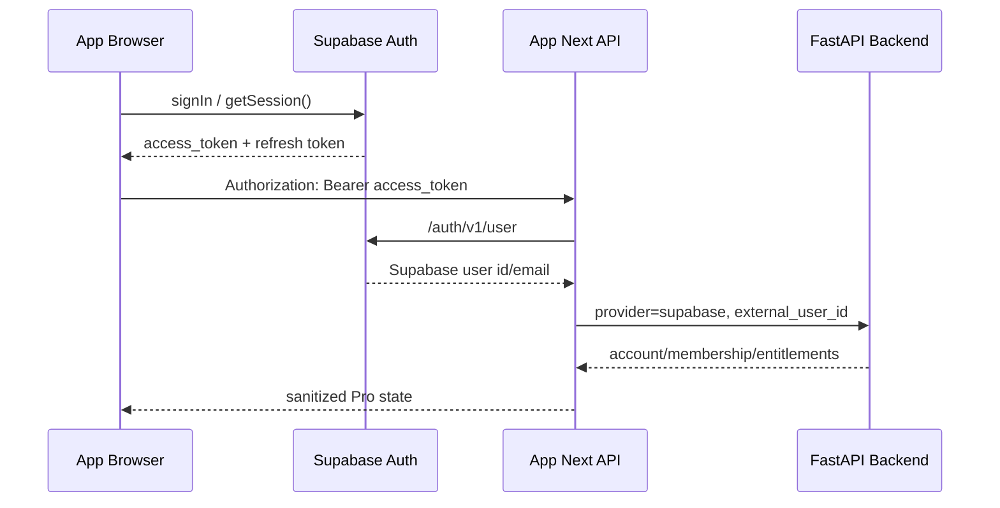
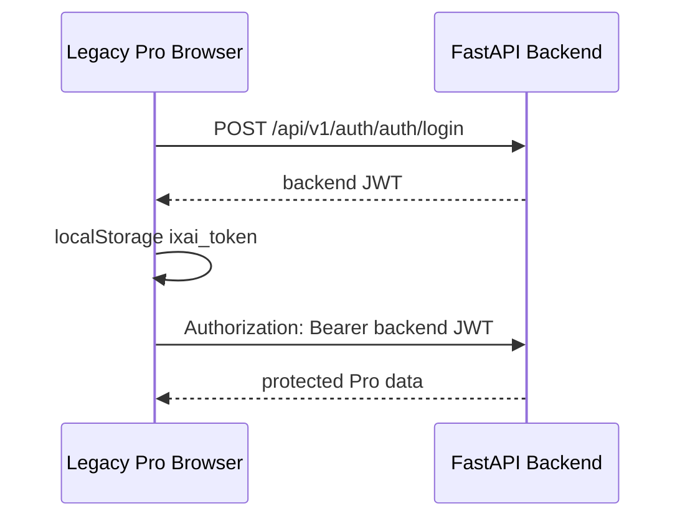
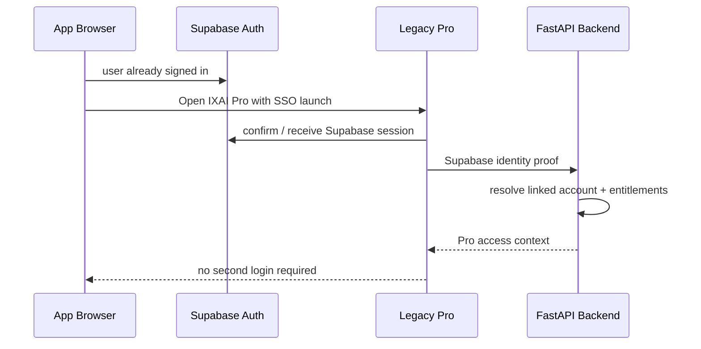
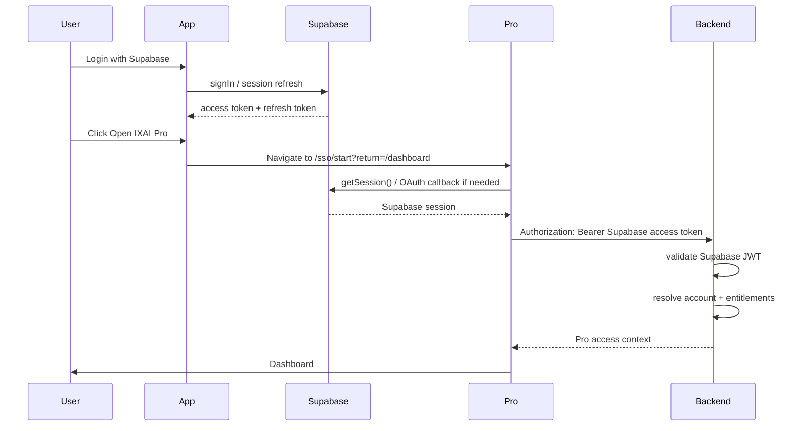
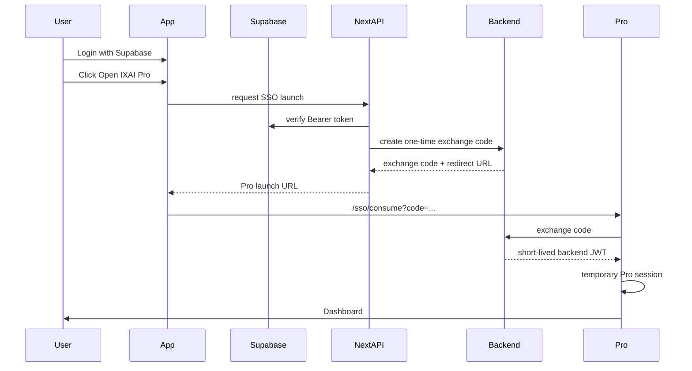

# IXAI v1.61.0 — SSO Prototype & Implementation Readiness

This document turns the v1.60 Unified Login Foundation into an implementation-ready SSO prototype plan.

This version is architecture, validation, and planning only. It does not enable production SSO, change production authentication flows, issue new JWTs, update Supabase configuration, deploy, redesign UI, build Stripe, build broker integration, or build portfolio engines.

## 1. Target Outcome

```text
User logs into App once
↓
Clicks Open IXAI Pro
↓
Automatically enters Pro
↓
No second login required
```

Current production reality:

```text
App:        Supabase Auth
Backend:    accounts → memberships → entitlements
Legacy Pro: FastAPI JWT → localStorage ixai_token
```

Target direction:

```text
Supabase Auth = shared identity source
Backend accounts = product/account ownership layer
Backend entitlements = feature authorization layer
Legacy Pro = Pro UI surface that accepts App identity
```

## 2. Deep Auth Audit

### 2.1 App — `app/ixai-web-app`

Auth provider:

- Supabase Auth is the primary App auth provider.
- App login / register use Supabase browser client.
- LINE and lightweight identity remain separate identity/readiness layers, not the SSO source.

Session lifecycle:

- Browser client is created in `src/lib/supabase/client.ts`.
- Supabase session is persisted in browser `sessionStorage`, not server-readable cookies.
- `supabase.auth.getSession()` returns the current browser session.
- The App sends `Authorization: Bearer <supabase_access_token>` to trusted Next API routes.
- Next API routes verify the Bearer token by calling Supabase `/auth/v1/user`.

JWT usage:

- App does not issue its own JWT.
- Supabase access token is the App identity proof.
- Current Next API verification is remote verification through Supabase Auth, not local JWKS verification.

Refresh token flow:

- Supabase browser client has `autoRefreshToken: true`.
- Supabase controls access-token refresh using the refresh token.
- Next API routes do not receive refresh tokens.

Middleware / gate behavior:

- `components/auth/auth-entry-gate.tsx` gates non-public routes using the client identity provider.
- Public routes include `/pro`, `/portfolio`, `/fcn`, `/risk`, and preview routes to avoid blocking public/beta shells.
- Protected App/Pro API calls still require Bearer token headers when evaluating account-link / membership / entitlements.

Account-link flow:

```text
Browser Supabase session
→ getSupabaseAuthorizationHeaders()
→ POST /api/pro/account-link
→ resolveSupabaseIdentityFromBearer()
→ backend /api/v1/integrations/supabase/account-link
→ accounts.external_provider = supabase
→ accounts.external_user_id = Supabase user id
```

Membership / entitlement flow:

```text
GET /api/pro/membership
GET /api/pro/entitlements
→ Next API verifies Supabase Bearer token
→ backend /api/v1/membership/me or /api/v1/entitlements/me
→ account lookup by provider + external_user_id
→ sanitized membership / entitlement response
```

Trust boundaries:

- Browser can hold Supabase access token.
- Browser must not receive backend service/admin tokens.
- Browser should call App Next API for backend account/membership/entitlement access.
- Backend account-link and membership endpoints still need stronger server-to-server protection before real portfolio / FCN data is exposed.

### 2.2 Legacy Pro — `frontend/ixai-website-clean`

Auth provider:

- FastAPI backend email/password login.

Login flow:

```text
/login form
→ app/lib/api.ts login()
→ POST /api/v1/auth/auth/login
→ backend validates users.email + hashed_password
→ backend returns access_token
→ frontend stores ixai_token in localStorage
```

JWT creation:

- Backend creates HS256 JWT with `sub = backend users.id`.
- `ACCESS_TOKEN_EXPIRE_MINUTES` controls expiry.
- Legacy Pro does not understand Supabase tokens today.

Session persistence:

- `ixai_token` is stored in browser `localStorage`.
- `AppShell` checks `getToken()` and redirects to `/login` if missing.
- Protected API calls attach `Authorization: Bearer <ixai_token>`.

Dashboard access flow:

```text
Legacy Pro route
→ AppShell checks localStorage ixai_token
→ API requests call FastAPI directly
→ FastAPI OAuth2PasswordBearer validates backend JWT
→ user / portfolio / account APIs return data
```

Protected routes:

- `/dashboard`, `/portfolio`, `/fcn`, `/market`, `/alerts`, `/input`, `/import`, `/accounts`, `/settings` depend on `ixai_token`.
- No Supabase session is loaded in Legacy Pro today.

Trust boundaries:

- Browser directly calls backend.
- Backend trusts custom JWT only.
- This is the main mismatch with App Supabase Auth.

### 2.3 Backend — `backend/ixai_agent`

Auth model:

- Email/password users in `users`.
- Custom backend JWT in `app/core/security.py`.
- `app/api/deps.py` validates backend JWT through `OAuth2PasswordBearer`.

Current JWT validation:

```text
Authorization: Bearer <backend_jwt>
→ decode_access_token()
→ SECRET_KEY + ALGORITHM
→ sub = users.id
→ database user lookup
```

Account-link:

```text
POST /api/v1/integrations/supabase/account-link
→ provider must be supabase
→ external_user_id required
→ find/create Account
→ create shadow backend User if needed
→ create AccountMembership owner
→ ensure default Free membership
```

Membership lookup:

- `GET /api/v1/membership/me`
- Finds account by `account_id` or `provider + external_user_id`.
- Ensures/returns `plan_code`, `status`, and entitlements.

Entitlement lookup:

- `GET /api/v1/entitlements/me`
- Returns feature-gate map for linked account.

Current security assumption:

- Account-link / membership / entitlements are intended for App Next API proxy, but are not yet protected by server-to-server auth.
- Existing portfolio / FCN endpoints still expect backend JWT, not Supabase JWT.

## 3. Current Architecture Diagrams

### Current App → Backend Identity



### Current Legacy Pro



### Target Unified Login



## 4. SSO Options

### Option A — Unified Supabase Auth

Flow:

```text
App login
→ Supabase session
→ Legacy Pro loads Supabase client
→ Legacy Pro obtains Supabase access token
→ Backend validates Supabase JWT
→ Backend resolves account by external_user_id
→ Entitlement-gated Pro access
```

Pros:

- Single identity provider.
- Avoids custom SSO server.
- Aligns App, account-link, membership, and entitlement layers.
- Supabase manages JWT issuance, refresh, and session lifecycle.
- Cleaner long-term path to retire legacy password login.

Cons:

- Legacy Pro must replace `ixai_token` as the session source.
- Backend must validate Supabase JWT or support a trusted Supabase-token verification path.
- Current direct browser-to-FastAPI protected calls need to carry Supabase token and entitlement context.

Security:

- Backend must verify issuer, audience, expiry, signature, and `sub`.
- Backend must use Supabase `sub`, not email, as identity key.
- Entitlement checks must be enforced on backend protected APIs.
- No backend admin/service token should reach browser.

Complexity:

- Medium-high initial migration.
- Lower long-term maintenance.

Rollback:

- Keep legacy `/login` and backend JWT auth active behind fallback route.

Recommendation:

- Recommended target architecture.

### Option B — JWT Exchange Bridge

Flow:

```text
App Supabase session
→ App Next API verifies Supabase user
→ Backend exchange endpoint creates short-lived backend Pro JWT
→ Legacy Pro stores temporary Pro token
→ Existing backend protected endpoints keep working
```

Pros:

- Smaller change to Legacy Pro protected API client.
- Existing backend JWT validation can remain during transition.
- Good beta bridge if Option A touches too many endpoints at once.

Cons:

- Adds a second token lifecycle.
- Requires one-time code / nonce / short TTL / replay prevention.
- Logout sync is more complex.
- Can become permanent technical debt if not retired.

Security:

- Exchange endpoint must verify Supabase token and account link.
- Exchange token must be short-lived and audience-scoped.
- Launch URL must not contain long-lived tokens.
- Replay prevention is mandatory.

Complexity:

- Medium.
- Easier initial prototype, higher long-term maintenance.

Rollback:

- Disable exchange endpoint / launch flag and keep legacy login.

Recommendation:

- Acceptable transitional prototype if direct Supabase validation is too disruptive.
- Not preferred as final architecture.

### Option C — Custom SSO Server

Pros:

- Full control over token issuance and account federation.

Cons:

- Duplicates Supabase Auth capabilities.
- Highest operational and security burden.
- Requires custom refresh, revocation, key rotation, session storage, and audit.

Recommendation:

- Not recommended for current IXAI stage.

## 5. Recommended SSO Architecture

Recommended target:

```text
Supabase Auth
→ Supabase JWT
→ Backend Supabase JWT validation
→ account-link lookup
→ membership / entitlement authorization
→ Legacy Pro UI accepts shared identity
```

Implementation strategy:

1. Keep production App login unchanged.
2. Keep Legacy Pro login available as fallback.
3. Prototype Option A first on a low-risk endpoint:
   - Legacy Pro reads Supabase session.
   - Backend validates Supabase JWT.
   - Backend resolves linked account and entitlements.
4. If Option A is too disruptive, implement Option B as a short-lived exchange bridge.
5. Do not retire legacy JWT login until beta users can reliably enter Pro through App identity.

## 6. Technical Prototype Specification

### 6.1 Login Flow — Option A



Required prototype pieces:

- Legacy Pro Supabase browser client.
- Legacy Pro `/sso/start` or equivalent route.
- Backend dependency: `get_current_supabase_account`.
- Backend endpoint prototype: `GET /api/v1/auth/supabase/me` or a low-risk `/api/v1/sso/session`.
- Entitlement check uses `MembershipService`.

### 6.2 Login Flow — Option B



Required prototype pieces:

- App route: `POST /api/pro/sso-launch`.
- Backend route: `POST /api/v1/sso/exchange/start`.
- Backend route: `POST /api/v1/sso/exchange/consume`.
- One-time code store with TTL.
- Legacy Pro consume route.

### 6.3 Logout

Option A:

```text
App logout
→ Supabase signOut
→ Legacy Pro detects missing/expired Supabase session
→ Legacy Pro clears local Pro state
```

Option B:

```text
App logout
→ Supabase signOut
→ optional App → Pro logout redirect
→ Legacy Pro clears exchange token
→ backend short-lived token expires even if localStorage remains
```

Requirements:

- Legacy Pro must clear any local auth artifact on logout.
- Avoid long-lived backend JWT for SSO bridge.
- Keep legacy password logout unchanged during beta.

### 6.4 Expiration / Refresh

Option A:

- Supabase JS handles access-token refresh.
- Backend validates current Supabase access token per request.
- If token expired and refresh fails, Pro redirects to App login / Pro SSO start.

Option B:

- Exchange token should be short-lived.
- Refresh requires a new App-verified launch or refresh endpoint.
- Avoid silent indefinite backend token refresh unless backend also verifies Supabase session.

### 6.5 Failure Recovery

- No Supabase session: show App login / return link.
- Supabase token invalid: fail closed and show "Sign in again".
- Account not linked: route user back to `/account` Connect Pro Account.
- Entitlement insufficient: show gated Pro state, not raw dashboard data.
- Backend unavailable: keep legacy login fallback available during beta.

## 7. Security Requirements

CSRF:

- Option A Bearer-token API calls are not cookie-authenticated, so CSRF risk is lower than cookie sessions, but launch/redirect endpoints must still validate `state`.
- Option B exchange start / consume must use one-time code + state + TTL.

XSS:

- Supabase token in browser storage is reachable by XSS; reduce risk with strict CSP, no inline untrusted scripts, and avoiding token-in-URL.
- Do not place access tokens in query strings.

JWT replay:

- Option A relies on short-lived Supabase access tokens and backend validation.
- Option B must use one-time exchange code and short-lived backend JWT.

Token leakage:

- Never log Authorization headers.
- Never return refresh tokens to Next API or backend.
- Never expose Supabase service role key or backend admin tokens to browser.

Session fixation:

- SSO consume routes must bind code to state, intended redirect, issuer, and account.
- Regenerate local session artifacts after exchange.

Backend trust:

- Server-to-server calls need a future `IXAI_APP_BACKEND_INTERNAL_TOKEN` or signed request.
- Backend should not trust browser-provided `external_user_id` without validating Supabase token.

## 8. Migration Roadmap

### v1.62 — SSO Bridge Prototype

Scope:

- Select Option A or Option B.
- Build beta-only prototype.
- Keep legacy login unchanged.

Risk:

- Medium.

Rollback:

- Disable SSO prototype flag and use legacy login.

Success criteria:

- One beta user can open Legacy Pro from App without manually entering Pro password.
- Backend account link and entitlement check still apply.

### v1.63 — Silent Login

Scope:

- If Option A: Legacy Pro loads Supabase session and silently resolves backend account.
- If Option B: App creates launch URL and Pro consumes one-time code.

Risk:

- Medium-high around session mismatch.

Rollback:

- Return Pro CTA to legacy login URL.

Success criteria:

- Existing App session can enter Pro dashboard in beta without visible second login.

### v1.64 — Pro Dashboard Auto-Auth

Scope:

- Apply SSO session to core Pro dashboard routes.
- Enforce account + entitlement checks.
- Keep legacy login as fallback.

Risk:

- High if portfolio / FCN endpoints are not entitlement-safe.

Rollback:

- Restore AppShell `ixai_token` gate as primary.

Success criteria:

- Dashboard, Portfolio, FCN, Market, Alerts route gates understand shared identity.

### v1.65 — Remove Duplicate Login

Scope:

- Make Legacy Pro `/login` redirect to App / SSO entry for normal users.
- Keep backend password login only as admin/dev emergency fallback if needed.

Risk:

- High for users without migrated App identity.

Rollback:

- Re-enable legacy login page.

Success criteria:

- Beta users no longer need separate Pro credentials.

### v1.66 — Full Unified Identity

Scope:

- Supabase becomes canonical identity for App + Pro.
- Backend custom JWT no longer drives normal user sessions.
- Entitlements control every Pro module.

Risk:

- High; requires full QA and production rollout plan.

Rollback:

- Maintain legacy JWT fallback until all users are migrated.

Success criteria:

- App logout and Pro logout are consistent.
- No second login required.
- Backend protected routes validate shared identity and entitlements.

## 9. Effort Estimate

Option A:

- Prototype: 3–5 engineering days.
- Beta hardening: 1 week.
- Production rollout: 1–2 weeks.
- Long-term maintenance: lower.

Option B:

- Prototype: 2–4 engineering days.
- Beta hardening: 1 week.
- Production rollout: 1–2 weeks.
- Long-term maintenance: higher unless retired.

Option C:

- Prototype: 2+ weeks.
- Production rollout: 4+ weeks.
- Long-term maintenance: highest.

Recommended next step:

- v1.62 should prototype Option A first unless backend Supabase JWT validation or Legacy Pro Supabase client integration proves too disruptive.
- Keep Option B as fallback bridge only.

## 10. External Reference Notes

Supabase Auth sessions are represented by a JWT access token and refresh token; access tokens are short-lived and refresh tokens are single-use for refreshing sessions. Supabase also exposes JWT signing key / JWKS guidance for verification, including asymmetric signing-key discovery when available.

Official references:

- https://supabase.com/docs/guides/auth
- https://supabase.com/docs/guides/auth/sessions
- https://supabase.com/docs/guides/auth/jwts
- https://supabase.com/docs/guides/auth/signing-keys
