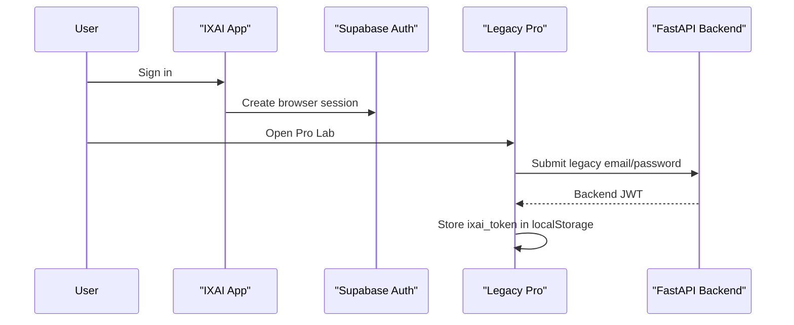
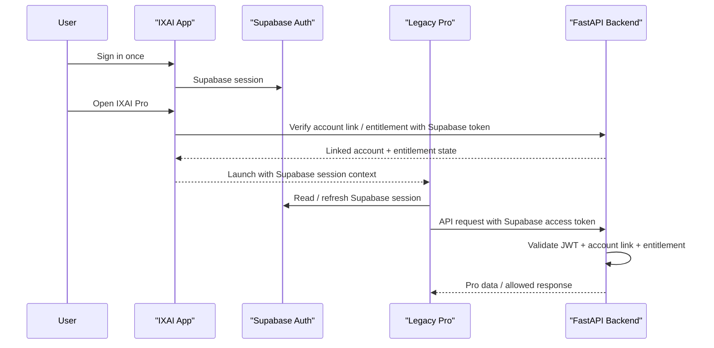
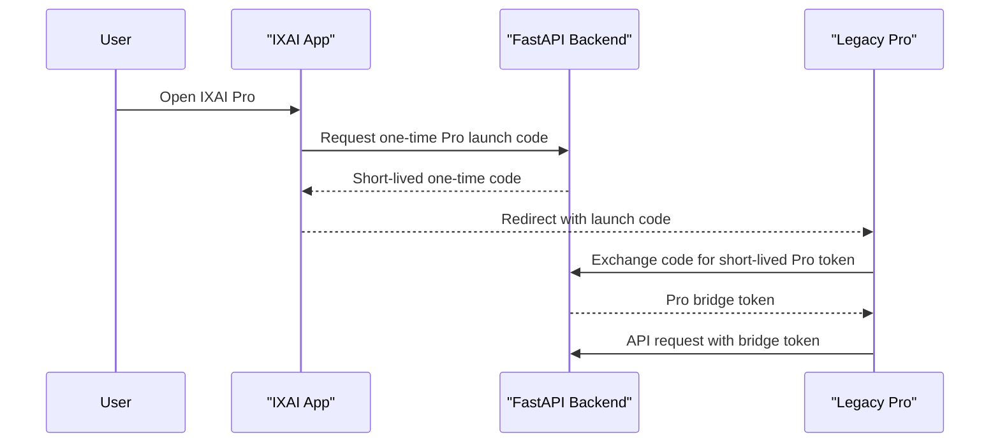

# IXAI SSO Prototype Blueprint

Version: `v1.61.1`

Purpose: define the phased implementation path for App to Pro SSO after the v1.60 and v1.61 architecture documents.

Status: design review only. No SSO code is implemented in this version.

## A. Target User Flow

```text
User signs in at app.ixuan.ai
→ Supabase session is active
→ User clicks Open IXAI Pro
→ App verifies account link and entitlement readiness
→ Legacy Pro receives a trusted authenticated session
→ User enters Pro without a second login
```

## B. Recommended Architecture

Recommended: Option A — Unified Supabase Auth.

Rationale:

- The App already uses Supabase Auth as the primary identity source.
- Backend already has Supabase external account-link, membership, and entitlement layers.
- Supabase access tokens are short-lived JWTs that can be validated across services.
- A single identity source reduces long-term operational complexity compared with maintaining both App auth and Legacy Pro custom JWT as equal sources of truth.

Fallback: Option B — JWT Exchange Bridge.

Use only if Legacy Pro cannot safely adopt Supabase Auth in the first prototype. The bridge should issue short-lived, audience-scoped, non-renewable Pro tokens and must not become a permanent parallel identity system.

## C. Sequence Diagrams

### Current Split Login



### Target Unified Supabase Auth



### Fallback JWT Exchange Bridge



## D. Phase Plan

### v1.62 — SSO Launch Endpoint

Goal:

- Build the first SSO launch boundary without changing production login behavior.

Deliverables:

- App launch endpoint or launch helper.
- Backend validation design implemented behind non-destructive beta path.
- Legacy Pro can receive launch intent but still falls back safely.

Risk:

- Medium. Incorrect launch behavior could confuse App users or bypass legacy login messaging.

Rollback:

- Keep `Open IXAI Pro Lab` as normal external link.
- Disable launch endpoint via config or feature flag.

Success Criteria:

- App can start a Pro launch attempt only for authenticated App users.
- Launch attempt does not expose tokens in logs or public UI.
- Legacy Pro login remains available as fallback.

### v1.63 — Silent Login Prototype

Goal:

- Allow beta users to enter Legacy Pro without submitting the legacy login form.

Deliverables:

- Legacy Pro Supabase session client or token bridge receiver.
- Backend accepts validated Supabase token or approved bridge token for selected beta endpoints.
- Non-sensitive session-debug output for QA.

Risk:

- High. Session storage and token forwarding mistakes can create security exposure.

Rollback:

- Disable silent login and return Legacy Pro to explicit login page.

Success Criteria:

- Beta App user can enter Pro once after App login.
- Legacy login fallback remains working.
- No token appears in URL after launch completion.

### v1.64 — Dashboard Auto Auth

Goal:

- Make Legacy Pro dashboard routes trust the new session source.

Deliverables:

- `AppShell` auth gate migrates from `ixai_token` only to Supabase / bridge session.
- Protected dashboard API calls use approved Authorization header.
- Backend enforces account-link and entitlement checks.

Risk:

- High. Many dashboard routes depend on shared API client behavior.

Rollback:

- Restore `ixai_token` gate and legacy backend JWT auth path.

Success Criteria:

- Dashboard routes load for SSO beta users.
- Unauthorized users still redirect to login / App account.
- Entitlement-disabled modules remain gated.

### v1.65 — Duplicate Login Removal

Goal:

- Remove the legacy login form as the normal beta entry while retaining emergency fallback.

Deliverables:

- Legacy `/login` becomes App SSO redirect / explanation page.
- Legacy register flow is disabled or clearly deprecated.
- App remains the primary signup and login surface.

Risk:

- Medium. Existing Pro Lab beta testers may rely on assigned credentials.

Rollback:

- Re-enable legacy login form for assigned beta credentials.

Success Criteria:

- New users never need a separate Pro password.
- Existing beta users can still be supported during transition.

### v1.66 — Unified Identity Complete

Goal:

- Complete shared identity for App and Pro surfaces.

Deliverables:

- Supabase identity is the single login source.
- Backend account link is the product ownership layer.
- Membership / entitlement controls Pro access.
- Legacy backend JWT is no longer the primary browser session for Pro.

Risk:

- Medium to high depending on backend endpoint migration completeness.

Rollback:

- Restore legacy login fallback and keep App Pro CTA in bridge mode.

Success Criteria:

- App login to Pro access works without duplicate login.
- Logout and expiration behavior are consistent.
- Entitlements remain server-authoritative.

## E. Implementation Readiness Checklist

Before v1.62 code begins:

- Confirm Supabase project URL and JWT validation method.
- Confirm whether Legacy Pro can add Supabase JS client without breaking build.
- Confirm backend can validate Supabase JWT by issuer / audience / signing key.
- Confirm no token is passed through query string except a one-time code if Option B fallback is used.
- Confirm rollback path keeps legacy login usable.

