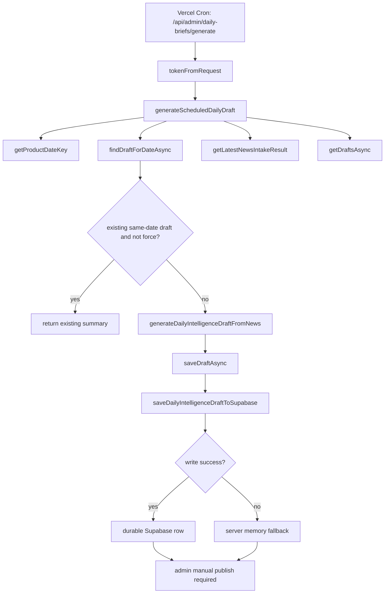
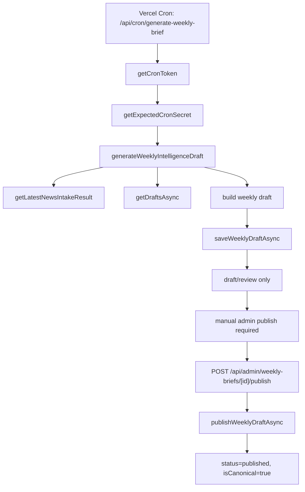
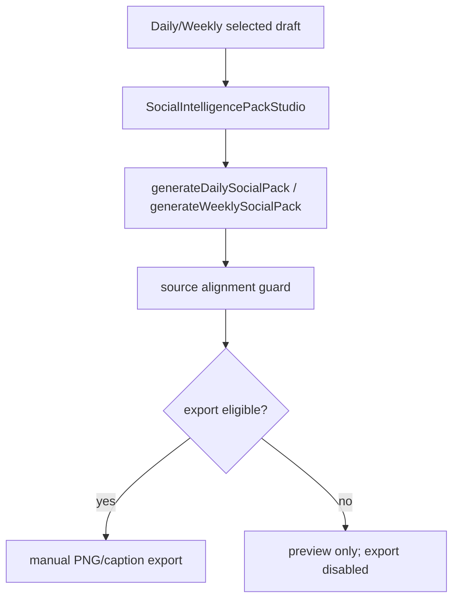

# V15.2 Admin Brief Pipeline Audit

Review date: 2026-07-04

Scope: production admin audit for Daily / Weekly Brief generation, publish, Social Pack linkage, public readback, and source-level pipeline mapping.

This is an audit only. No product code, API, database, auth, scheduler, provider, AI, trading, recommendation, or Workspace Graph logic was changed.

## 1. Executive Summary

Production brief output is stale after 2026-06-29.

Confirmed public readback:

- Latest Daily Brief: `daily-intelligence-2026-06-29`
- Daily published at: `2026-06-29T05:36:33.407+00:00`
- Latest Weekly Brief: `weekly-intelligence-2026-07-05`
- Weekly published at: `2026-06-29T05:37:27.62+00:00`

The strongest finding is not a Social Pack blocker. The current pipeline is explicitly review-first:

- Daily scheduler generates or reuses a draft only.
- Weekly scheduler generates a draft only and explicitly never publishes.
- Human publish remains required.
- Daily publish/write failures can degrade to in-memory fallback, which can mask durable production failure.
- Scheduler status is not durable. `lastGeneration` is process memory only and returned `null` in production admin API.
- Admin UI automation is constrained by a secondary `sessionStorage` gate even when the admin cookie authenticates API requests.

Confirmed production API evidence shows the admin APIs are reachable with an authenticated admin session:

- `/api/admin/session`: `authenticated: true`
- `/api/admin/daily-briefs`: 36 drafts, all `published`; latest is 2026-06-29.
- `/api/admin/weekly-briefs`: 13 drafts; latest canonical published weekly is 2026-07-05, published on 2026-06-29.
- `/api/admin/daily-briefs/scheduler/status`: `schedulerConfigured: true`, `lastGeneration: null`.

The highest-confidence root cause is an operational/pipeline gap: scheduler creates draft/review material but does not publish, and the system lacks durable scheduler run history plus durable Daily write failure surfacing. If generation has run since 2026-06-29, the audit could not prove it from the admin health/status endpoint because the status is process-local and currently null.

## 2. Production Admin Access Status

Production `/admin` is protected by the internal admin password gate.

Observed access states:

| Check | Result |
| --- | --- |
| Headed browser `/admin` | Successfully reached true admin home after admin access was available. |
| Headless browser without stored admin state | Blocked by password gate. |
| Saved Playwright storage state | Admin API session was authenticated, but UI remained at password gate because `AdminGate` also requires `sessionStorage` key `ixai.admin.gate.v1=granted`. |
| `/api/admin/session` with saved state | `200`, `authenticated: true`, `mode: password`, `passwordConfigured: true`. |

Important audit note:

The admin UI has a dual gate: an HTTP-only cookie plus client `sessionStorage`. Playwright `storageState` preserves cookies/localStorage, but not `sessionStorage`, so automated UI reloads can appear blocked even while admin API calls are authorized.

## 3. Admin Route Inventory

Source inventory:

| Route | Source | Production status | Notes |
| --- | --- | --- | --- |
| `/admin` | `app/admin/page.tsx` | 200 | Main admin console behind password gate. |
| `/admin/daily-briefs` | `app/admin/daily-briefs/page.tsx` | 200 | Actual Daily / Weekly / Social Pack admin studio route. |
| `/admin/daily-briefs#weekly` | hash section | 200 | Weekly workflow is a tab/section inside daily-briefs page. |
| `/admin/daily-briefs#queue` | hash section | 200 | Publishing queue is a sidebar/hash entry, not a separate app route. |
| `/admin/daily` | no route found | 404 | Not an implemented route. |
| `/admin/weekly` | no route found | 404 | Not an implemented route. |
| `/admin/social` | no route found | 404 | Social Pack exists inside `DailyBriefsAdmin`, not as a standalone route. |
| `/admin/settings` | no route found | 404 | Admin settings are not implemented as a separate route. |

Admin navigation source:

- `components/admin/admin-sidebar.tsx`
- Content operations entries:
  - Daily Brief flow: `/admin/daily-briefs`
  - Weekly Intelligence flow: `/admin/daily-briefs#weekly`
  - Publishing queue: `/admin/daily-briefs#queue`

## 4. Daily Brief Pipeline

Source-level flow:

Admin manual generation:

- `POST /api/admin/daily-briefs/draft`
- Calls `getLatestNewsIntakeResult()`.
- Calls `generateDailyIntelligenceDraftFromNews()`.
- Calls `saveDraftAsync()`.
- Returns draft, drafts list, intake, AI/provider metadata, persistence metadata.

Admin manual publish:

- `POST /api/admin/daily-briefs`
- Payload: `{ action: "publish", id }`
- Calls `publishDraftAsync(id)`.
- `publishDraftAsync` sets `status: "published"`, `publishedAt`, `updatedAt`, then calls `saveDraftAsync()`.

Public Daily readback:

- `GET /api/daily-briefs`
- `GET /api/daily-briefs?slug=...`
- `GET /daily-brief/[slug]`
- Reads published only via `getPublishedIntelligenceBriefsAsync()` and `getLatestPublishedBriefAsync()`.

Production Daily API evidence:

| Check | Result |
| --- | --- |
| `/api/admin/daily-briefs` | 200 |
| Admin daily draft count | 36 |
| Status distribution | 36 `published` |
| Latest admin daily | `daily-intelligence-2026-06-29` |
| Latest daily publishedAt | `2026-06-29T05:36:33.407+00:00` |
| `/api/daily-briefs` | 200 |
| Public latest daily | `daily-intelligence-2026-06-29` |
| Public latest detail page | `/daily-brief/daily-intelligence-2026-06-29` returned 200 |

Daily failure risks:

- Scheduled generation can return `existing` for same product date and does not publish.
- Daily Supabase write failure is caught and falls back to memory via `saveDraftAsync()`.
- Daily API routes do not surface a durable write failure to admin when fallback happens.
- Scheduler `lastGeneration` is module memory only and was `null` in production status.
- If Vercel cron failed, or generated only an unreviewed draft, production public routes would remain stale.

## 5. Weekly Brief Pipeline

Source-level flow:

Scheduler route:

- `GET/POST /api/cron/generate-weekly-brief`
- Explicit response note: `Weekly cron creates draft/review material only. It never publishes.`

Admin generation:

- `POST /api/admin/weekly-briefs/generate`
- Catches `WeeklyPersistenceError`.
- Returns 502 for persistence failure.

Admin save/review:

- `PATCH /api/admin/weekly-briefs/[id]`
- Surfaces persistence failure with 502.

Admin publish:

- `POST /api/admin/weekly-briefs/[id]/publish`
- Calls `publishWeeklyDraftAsync(id)`.
- Refuses success unless returned draft has `status === "published"`.

Public Weekly readback:

- `GET /api/weekly-briefs/latest`
- `GET /api/weekly-briefs/[slug]`
- Reads latest published canonical weekly.

Production Weekly API evidence:

| Check | Result |
| --- | --- |
| `/api/admin/weekly-briefs` | 200 |
| Admin weekly count | 13 |
| Status distribution | 7 `published`, 2 `draft`, 2 `review`, 2 `archived` |
| Latest canonical weekly | `weekly-intelligence-2026-07-05` |
| Latest weekly publishedAt | `2026-06-29T05:37:27.62+00:00` |
| Latest weekly generatedAt | `2026-06-29T05:36:51.421+00:00` |
| `/api/weekly-briefs/latest` | 200 |
| Public weekly page | `/weekly-brief` returned 200 |
| Public weekly detail | `/weekly-brief/weekly-intelligence-2026-07-05` returned 200 |

Weekly failure risks:

- Weekly cron never publishes by design.
- If editor did not manually publish after 2026-06-29, public weekly remains stale even if drafts exist.
- The admin list already includes draft/review rows, but public route only reads published canonical.
- Weekly has stricter persistence error handling than Daily; this is safer, but can block if Supabase write fails.

## 6. Social Pack Pipeline

Source-level flow:

Source files:

- `components/admin/social-intelligence-pack-studio.tsx`
- `src/lib/intelligence/social/social-intelligence-pack.ts`

Findings:

- Social Pack generation is client/admin preview/export logic.
- It uses selected Daily/Weekly draft data.
- Weekly export has guards requiring published canonical source for formal export.
- No source-level evidence was found that Social Pack generation blocks Daily or Weekly publish.
- Social Pack is downstream and should remain optional.

Recommended policy:

- Keep Social Pack as a non-blocking downstream job.
- Do not require Social Pack success for Daily/Weekly public publish.
- If Social Pack fails, surface export status only and keep published Brief intact.

## 7. Public Route Readback

Production public readback:

| Public route/API | Status | Result |
| --- | --- | --- |
| `/api/daily-briefs` | 200 | Latest `daily-intelligence-2026-06-29`; 34 public intelligence briefs. |
| `/daily-brief/daily-intelligence-2026-06-29` | 200 | Detail route loads public Daily page. |
| `/api/weekly-briefs/latest` | 200 | Latest `weekly-intelligence-2026-07-05`; published at 2026-06-29. |
| `/weekly-brief` | 200 | Weekly index loads latest published weekly. |
| `/weekly-brief/weekly-intelligence-2026-07-05` | 200 | Weekly detail route loads public report. |

Public routes are working, but they are reading stale latest published rows.

## 8. API / Network Findings

Production admin API findings with authenticated admin cookie:

| API | Status | Finding |
| --- | --- | --- |
| `/api/admin/session` | 200 | Authenticated true. |
| `/api/admin/daily-briefs` | 200 | Latest published Daily is 2026-06-29. |
| `/api/admin/daily-briefs/scheduler/status` | 200 | Scheduler configured, lastGeneration null. |
| `/api/admin/weekly-briefs` | 200 | Latest published Weekly is 2026-07-05, published 2026-06-29. |
| `/api/daily-briefs` | 200 | Public latest Daily is 2026-06-29. |
| `/api/weekly-briefs/latest` | 200 | Public latest Weekly is 2026-07-05. |

Route-level findings:

| Route | Status | Finding |
| --- | --- | --- |
| `/admin/daily` | 404 | Not implemented. |
| `/admin/weekly` | 404 | Not implemented. |
| `/admin/social` | 404 | Not implemented. |
| `/admin/settings` | 404 | Not implemented. |

No repeated request storm was observed during this audit.

## 9. Console Findings

Observed console findings:

- Authenticated headed `/admin`: no console error storm observed.
- Headless gated `/admin` and `/admin/daily-briefs`: no console errors.
- Nonexistent admin routes (`/admin/daily`, `/admin/weekly`, `/admin/social`, `/admin/settings`) produced normal Next.js 404 page console entries, not a brief pipeline failure.

No production browser console finding directly explains Daily/Weekly停產.

## 10. Auth / Permission Findings

Admin auth source:

- `src/lib/admin/auth.ts`
- `app/api/admin/session/route.ts`
- `components/admin/admin-gate.tsx`

Findings:

- Production admin password is configured.
- API auth uses `ixai_admin_session` HTTP-only cookie.
- UI unlock additionally requires `sessionStorage` key `ixai.admin.gate.v1=granted`.
- This makes API automation possible after cookie capture, but full UI automation may still show the password gate unless `sessionStorage` is also set in-page.

This is not the Brief停產 root cause, but it affects future authenticated admin QA tooling.

## 11. Source-level Pipeline Map

Daily source files:

| Area | File |
| --- | --- |
| Admin page | `app/admin/daily-briefs/page.tsx` |
| Admin UI | `components/admin/daily-briefs-admin.tsx` |
| Generate scheduled Daily | `app/api/admin/daily-briefs/generate/route.ts` |
| Generate manual Daily | `app/api/admin/daily-briefs/draft/route.ts` |
| Save/publish/list Daily | `app/api/admin/daily-briefs/route.ts` |
| Daily scheduler status | `app/api/admin/daily-briefs/scheduler/status/route.ts` |
| Daily scheduler library | `src/lib/editorial/scheduler.ts` |
| Daily repository | `src/lib/editorial/repository.ts` |
| Daily Supabase persistence | `src/lib/editorial/persistence.ts` |
| Daily public API | `app/api/daily-briefs/route.ts` |

Weekly source files:

| Area | File |
| --- | --- |
| Weekly cron | `app/api/cron/generate-weekly-brief/route.ts` |
| Admin weekly list | `app/api/admin/weekly-briefs/route.ts` |
| Admin weekly generate | `app/api/admin/weekly-briefs/generate/route.ts` |
| Admin weekly save/review | `app/api/admin/weekly-briefs/[id]/route.ts` |
| Admin weekly publish | `app/api/admin/weekly-briefs/[id]/publish/route.ts` |
| Weekly repository/generator | `src/lib/editorial/weekly.ts` |
| Weekly public latest | `app/api/weekly-briefs/latest/route.ts` |
| Weekly public detail | `app/api/weekly-briefs/[slug]/route.ts` |

Scheduler config:

| Cron | Schedule | Purpose |
| --- | --- | --- |
| `/api/admin/daily-briefs/generate` | `30 23 * * *` | Daily draft generation. |
| `/api/cron/generate-weekly-brief` | `0 0 * * 0` | Weekly draft generation. |

Cron secret source:

- `src/lib/editorial/scheduler.ts`
- `isSchedulerConfigured()`: `IXAI_CRON_SECRET || CRON_SECRET`
- `getExpectedCronSecret()`: `IXAI_CRON_SECRET ?? CRON_SECRET ?? ""`

Important risk:

Vercel Cron natively sends `Authorization: Bearer $CRON_SECRET` when `CRON_SECRET` is configured. If production relies only on `IXAI_CRON_SECRET`, Vercel's automatic cron auth may not match unless custom invocation also sends that token. This remains a suspicion requiring Vercel logs/env verification.

## 12. Failure Points

| Priority | Failure point | Evidence | Impact |
| --- | --- | --- | --- |
| P0 | No auto-publish path | Cron route and admin copy explicitly say draft/review only. | Public Daily/Weekly can stop after last manual publish. |
| P0 | Daily write failure can silently fallback | `saveDailyIntelligenceDraftToSupabase` catches write failure and `saveDraftAsync` falls back to memory. | Admin may think workflow continued while durable public row was not written. |
| P0 | Scheduler status is not durable | Production `/api/admin/daily-briefs/scheduler/status` returned `lastGeneration: null`; source stores it in module memory. | Cannot determine whether cron ran, failed, or generated after 2026-06-29 from admin. |
| P1 | Cron token ambiguity | Code prefers `IXAI_CRON_SECRET` over `CRON_SECRET`; Vercel Cron documents `CRON_SECRET` bearer behavior. | Possible 401 scheduler failures if env mismatch exists. |
| P1 | Weekly only has manual publish | `/api/cron/generate-weekly-brief` says it never publishes. | Weekly can be generated but remain draft/review. |
| P1 | Admin UI gate has non-persistent sessionStorage layer | API auth true but UI gate shown in storage-state replay. | Blocks repeatable admin QA unless tooling sets sessionStorage. |
| P2 | Nonexistent assumed admin routes 404 | `/admin/daily`, `/admin/weekly`, `/admin/social`, `/admin/settings` are not routes. | Operational confusion during manual verification. |
| P2 | Social Pack mixed with Brief studio | Social Pack is inside `/admin/daily-briefs`, not standalone. | Harder to reason about downstream vs core publish separation. |

## 13. Confirmed Root Cause / Suspicions

Confirmed:

- Latest public Daily is stale at `daily-intelligence-2026-06-29`.
- Latest public Weekly is stale at `weekly-intelligence-2026-07-05`, published on 2026-06-29.
- Admin API confirms no newer published Daily/Weekly rows.
- Scheduler is configured but admin status has no durable last-generation record.
- Current scheduler routes do not publish.
- Weekly cron explicitly says it never publishes.
- Social Pack is downstream and no evidence shows it blocks Brief publish.

Strongest suspected root cause:

The production pipeline is not fault-tolerant enough for unattended output. It generates draft/review material, requires manual publish, and lacks durable scheduler/run-state visibility. Daily can also mask durable write failures through memory fallback.

Unconfirmed but important suspicion:

Vercel Cron auth may be mismatched if production uses `IXAI_CRON_SECRET` instead of `CRON_SECRET`. This requires Vercel runtime logs or env inspection.

## 14. Recommended Hotfix Plan

Do not start V16 until Brief reliability is recovered.

Recommended V15.2 hotfix order:

1. Add durable Brief run logging.
   - Log `fetch_news`, `generate`, `save`, `publish`, `social_pack`, and `public_readback`.
   - Store latest success/failure for Daily and Weekly.

2. Split Brief Core from Social Pack.
   - Daily/Weekly publish must not depend on Social Pack export.
   - Social Pack remains optional downstream.

3. Make Daily persistence loud for production writes.
   - If Supabase is configured and write fails, return structured error instead of silently falling back to memory.
   - Keep local/dev fallback, but do not mask production durable write failure.

4. Add Limited Brief output.
   - Provider failure should generate a limited status report instead of no output.
   - Show data quality status in admin and public pages.

5. Add manual recovery controls.
   - Generate draft.
   - Publish latest draft.
   - Regenerate with force.
   - Public readback verification.

6. Verify cron secret behavior.
   - Prefer `CRON_SECRET` for Vercel Cron or explicitly document `IXAI_CRON_SECRET` custom usage.
   - Add admin-visible token mode diagnostics without exposing secrets.

7. Add production checklist.
   - Confirm latest generated date.
   - Confirm latest published date.
   - Confirm public route readback.
   - Confirm social pack optional export status.

## 15. Production Env Checklist

Needs verification outside source code:

- `CRON_SECRET` exists in Vercel Production.
- `IXAI_CRON_SECRET` exists only if custom callers send it.
- Vercel Cron invocations for `/api/admin/daily-briefs/generate` after 2026-06-29.
- Vercel Cron invocations for `/api/cron/generate-weekly-brief` after 2026-06-29.
- Response status for cron invocations: 200 / 401 / 500 / timeout.
- Supabase write env present for service-role writes.
- Daily table write success after 2026-06-29.
- Weekly table write success after 2026-06-29.
- Whether admin drafts newer than 2026-06-29 exist but remain unpublished.

## 16. Screenshots / Evidence Paths

Screenshots and scan JSON are local QA artifacts and should not be committed:

- `qa-artifacts/v152-admin-brief-pipeline-audit/admin-headed-after-wait.png`
- `qa-artifacts/v152-admin-brief-pipeline-audit/admin-headed-auth-state-capture.png`
- `qa-artifacts/v152-admin-brief-pipeline-audit/admin.png`
- `qa-artifacts/v152-admin-brief-pipeline-audit/admin-daily-briefs.png`
- `qa-artifacts/v152-admin-brief-pipeline-audit/admin-daily-briefs-weekly.png`
- `qa-artifacts/v152-admin-brief-pipeline-audit/admin-daily-briefs-queue.png`
- `qa-artifacts/v152-admin-brief-pipeline-audit/admin-authenticated-state.png`
- `qa-artifacts/v152-admin-brief-pipeline-audit/admin-daily-briefs-authenticated-state.png`
- `qa-artifacts/v152-admin-brief-pipeline-audit/admin-weekly-briefs-authenticated-state.png`
- `qa-artifacts/v152-admin-brief-pipeline-audit/public-daily-brief-daily-intelligence-2026-06-29.png`
- `qa-artifacts/v152-admin-brief-pipeline-audit/public-weekly-brief.png`
- `qa-artifacts/v152-admin-brief-pipeline-audit/public-weekly-brief-weekly-intelligence-2026-07-05.png`
- `qa-artifacts/v152-admin-brief-pipeline-audit/scan-results.json`
- `qa-artifacts/v152-admin-brief-pipeline-audit/authenticated-admin-scan-results.json`
- `qa-artifacts/v152-admin-brief-pipeline-audit/authenticated-admin-state-scan-results.json`

## 17. What is blocked

Blocked without Vercel runtime/env access:

- Exact cron invocation status after 2026-06-29.
- Whether cron returned 401 due to token mismatch.
- Whether cron returned 500 due to provider/generator/persistence failure.
- Whether Supabase rejected Daily/Weekly writes after 2026-06-29.
- Whether manual admin publish was attempted after 2026-06-29.

Blocked by current admin UI gate behavior:

- Repeatable full UI automation from Playwright `storageState` alone, because `AdminGate` also requires sessionStorage.

Not blocked:

- Public readback latest dates.
- Admin API latest Daily/Weekly inventory with authenticated cookie.
- Source-level route, publish, scheduler, and Social Pack mapping.

## 18. V15.2.1 Hotfix Follow-up

V15.2.1 addresses the audit's highest-confidence gaps without adding schema changes:

- Adds derived Brief publish health to Daily / Weekly admin APIs.
- Shows latest published, latest draft/review, stale published state, and draft/publish gap in `/admin/daily-briefs`.
- Keeps scheduler behavior explicit: scheduler creates draft/review material; manual publish remains required.
- Makes Daily publish durable-aware so a Supabase write failure returns structured failure instead of silently treating memory fallback as public success.
- Keeps Social Pack optional and downstream.

This does not replace Vercel runtime log review. Production still needs `CRON_SECRET`, cron response status, and Supabase write health verification.
