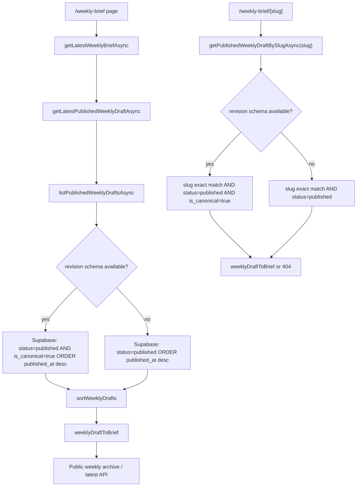
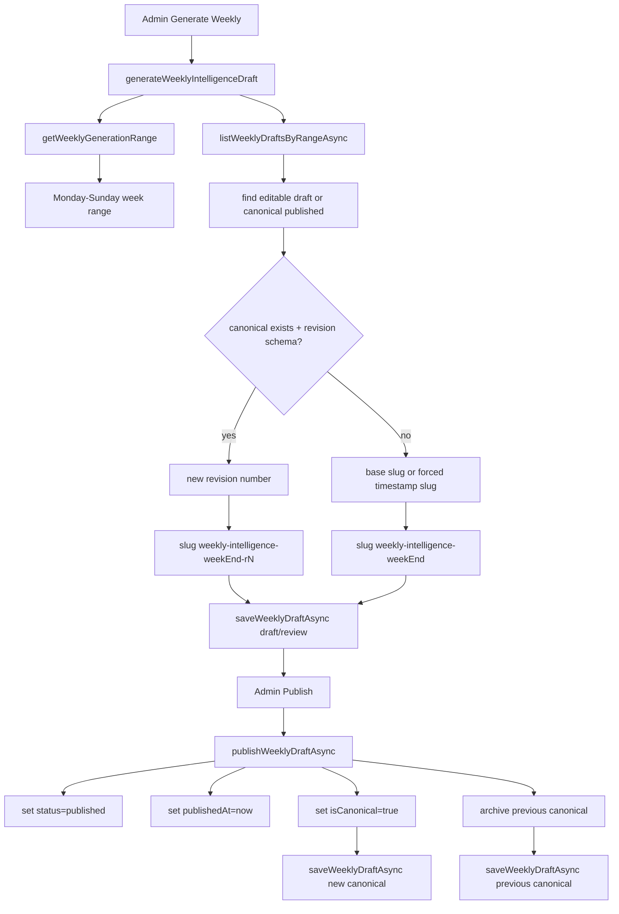

# v1.82.1 — Weekly Canonical Diagnostics

## Problem Summary

This diagnostic pass investigates the Weekly Brief symptoms observed on 2026-06-07:

- Public Weekly Brief appears to stay on `2026-06-01 – 2026-06-07`.
- Latest public Weekly slug is `weekly-intelligence-2026-06-07-r3`.
- Base slug `weekly-intelligence-2026-06-07` returns `not_found`.
- Latest public Weekly `publishedAt` appears stale: `2026-06-01T16:55:31.589+00:00`.

This version is diagnostics-only. It does not modify Weekly generation, Weekly persistence, Supabase schema, Social Pack source guard, Portfolio / FCN / Stock / Crypto files, auth, SSO, backend, LINE, or Stripe.

## Files Audited

- `src/lib/editorial/weekly.ts`
- `src/lib/weeklyBriefs.ts`
- `app/weekly-brief/page.tsx`
- `app/weekly-brief/[slug]/page.tsx`
- `app/api/weekly-briefs/latest/route.ts`
- `app/api/weekly-briefs/[slug]/route.ts`
- `app/api/admin/weekly-briefs/route.ts`
- `app/api/admin/weekly-briefs/generate/route.ts`
- `app/api/admin/weekly-briefs/[id]/publish/route.ts`
- `app/api/admin/weekly-briefs/[id]/route.ts`
- `components/admin/daily-briefs-admin.tsx`
- `components/admin/social-intelligence-pack-studio.tsx`

Repo search terms included:

- `weekly-intelligence`
- `week_start`
- `week_end`
- `revision_number`
- `is_canonical`
- `canonical`
- `superseded_at`
- `superseded_by`
- `publishedAt`
- `published_at`
- `slug`
- `weekly revision`
- `WeeklyRevision`
- `getLatestWeekly`
- `publishWeekly`
- `weekly row`
- `status=published`

Optional paths requested by the audit that do not currently exist:

- `src/lib/weekly/`
- `src/lib/content/`
- `components/weekly/`

## Weekly Readback Flow



Readback conclusions:

- Public latest weekly and `/weekly-brief` use the same canonical published source path.
- With revision schema available, latest query requires:
  - `status = published`
  - `is_canonical = true`
  - `order = published_at.desc.nullslast`
- With revision schema available, slug detail requires exact slug plus canonical published status.
- A base slug 404 is expected when the canonical row slug is revisioned as `weekly-intelligence-2026-06-07-r3`.
- Public weekly API applies `cache-control: public, s-maxage=300, stale-while-revalidate=600`, so recent changes can be stale for a few minutes but not indefinitely.

## Weekly Publish Flow



Publish conclusions:

- `generateWeeklyIntelligenceDraft()` creates the weekly range with `getWeeklyGenerationRange()`.
- The current rule is Monday-to-Sunday using UTC date math.
- On 2026-06-07, `2026-06-01 – 2026-06-07` is expected.
- If a canonical weekly already exists and revision schema is available, a new revision slug is generated:
  - `weekly-intelligence-${weekEnd}-r${revisionNumber}`
- `publishWeeklyDraftAsync()` should set:
  - `status: "published"`
  - `publishedAt: now`
  - `isCanonical: true`
  - `updatedAt: now`
  - `updatedBy: "editorial_studio"`
- If a previous canonical exists, it is saved as:
  - `status: "archived"`
  - `isCanonical: false`
  - `supersededAt: now`
  - `supersededBy: current.id`

## Expected vs Suspicious Findings

### Expected

`2026-06-01 – 2026-06-07` on 2026-06-07:

- Expected under current weekly range policy.
- The weekly range is Monday through Sunday.
- The app should not show `2026-06-08 – 2026-06-14` as the current weekly recap until the next week generation cycle.

Base slug 404:

- Expected when revision schema is active and the canonical slug is revisioned.
- `weekly-intelligence-2026-06-07` can 404 if no canonical published row exists with that exact slug.
- `weekly-intelligence-2026-06-07-r3` is the exact canonical slug returned by latest readback.

### Suspicious

`weekly-intelligence-2026-06-07-r3` with stale-looking `publishedAt`:

- Suspicious because `publishWeeklyDraftAsync()` sets `publishedAt = now` on publish.
- If r3 was published after r1 / r2, its `published_at` should normally reflect the publish time of r3.
- A stale `published_at` could mean:
  - r3 inherited old `published_at` during a save/edit flow before publish.
  - r3 was created or published earlier than expected.
  - an admin PATCH/save path preserved stale `published_at` before canonical publish.
  - multiple canonical rows exist and latest sorting picked an unexpected row.
  - production latest API was temporarily cache-stale when observed.
  - the row being read is not the row operators expect.

No code-level proof of the exact cause was found without direct Supabase row inspection.

## Read-Only Supabase SQL Diagnostics

Run these queries in Supabase SQL Editor. They are read-only.

### 1. Inspect latest weekly rows

```sql
select
  id,
  slug,
  title,
  status,
  week_start,
  week_end,
  revision_number,
  parent_weekly_id,
  is_canonical,
  superseded_at,
  superseded_by,
  publish_date,
  generated_at,
  published_at,
  created_at,
  updated_at,
  created_by,
  updated_by
from public.ixai_weekly_intelligence_drafts
order by coalesce(published_at, updated_at, generated_at) desc nulls last
limit 20;
```

### 2. Inspect the specific r3 slug

```sql
select
  id,
  slug,
  title,
  status,
  week_start,
  week_end,
  revision_number,
  parent_weekly_id,
  is_canonical,
  superseded_at,
  superseded_by,
  revision_note,
  publish_date,
  generated_at,
  published_at,
  created_at,
  updated_at,
  created_by,
  updated_by
from public.ixai_weekly_intelligence_drafts
where slug = 'weekly-intelligence-2026-06-07-r3';
```

### 3. Inspect the base slug

```sql
select
  id,
  slug,
  title,
  status,
  week_start,
  week_end,
  revision_number,
  parent_weekly_id,
  is_canonical,
  superseded_at,
  superseded_by,
  publish_date,
  generated_at,
  published_at,
  created_at,
  updated_at
from public.ixai_weekly_intelligence_drafts
where slug = 'weekly-intelligence-2026-06-07';
```

### 4. Inspect all revisions for the same week

```sql
select
  id,
  slug,
  status,
  week_start,
  week_end,
  revision_number,
  parent_weekly_id,
  is_canonical,
  superseded_at,
  superseded_by,
  publish_date,
  generated_at,
  published_at,
  created_at,
  updated_at,
  updated_by
from public.ixai_weekly_intelligence_drafts
where week_start = '2026-06-01'
  and week_end = '2026-06-07'
order by revision_number asc nulls last, created_at asc;
```

### 5. Confirm canonical count for the week

```sql
select
  week_start,
  week_end,
  count(*) filter (where status = 'published') as published_count,
  count(*) filter (where status = 'published' and is_canonical = true) as canonical_published_count,
  array_agg(slug order by revision_number asc nulls last) as slugs
from public.ixai_weekly_intelligence_drafts
where week_start = '2026-06-01'
  and week_end = '2026-06-07'
group by week_start, week_end;
```

### 6. Detect any week with multiple canonical published rows

```sql
select
  week_start,
  week_end,
  count(*) as canonical_published_count,
  array_agg(slug order by published_at desc nulls last) as canonical_slugs
from public.ixai_weekly_intelligence_drafts
where status = 'published'
  and is_canonical = true
group by week_start, week_end
having count(*) > 1
order by week_end desc;
```

### 7. Compare canonical latest ordering

```sql
select
  id,
  slug,
  status,
  week_start,
  week_end,
  revision_number,
  is_canonical,
  published_at,
  updated_at,
  generated_at
from public.ixai_weekly_intelligence_drafts
where status = 'published'
  and is_canonical = true
order by published_at desc nulls last, updated_at desc nulls last
limit 10;
```

### 8. Compare same-week row chronology

```sql
select
  slug,
  revision_number,
  status,
  is_canonical,
  generated_at,
  publish_date,
  published_at,
  created_at,
  updated_at,
  superseded_at,
  superseded_by
from public.ixai_weekly_intelligence_drafts
where week_start = '2026-06-01'
  and week_end = '2026-06-07'
order by created_at asc;
```

## Recommended Safe Fix Options

No immediate product-code fix is recommended until the read-only SQL diagnostics are run.

Possible safe fixes after diagnostics:

1. If multiple canonical published rows exist:
   - Add an admin diagnostics guard that reports canonical conflicts.
   - Separately plan a controlled data cleanup.

2. If r3 is canonical but `published_at` is stale:
   - Confirm whether publish API was called for r3.
   - If publish API was not called, the UI may be treating a draft/revision as published incorrectly.
   - If publish API was called, inspect whether `saveWeeklyDraftAsync()` upsert merged stale `published_at` due to slug conflict or row mismatch.

3. If base slug is used anywhere for share/export:
   - Update that caller to use exact `draft.slug`, including revision suffix.
   - Do not add base-slug fallback unless product explicitly wants canonical alias behavior.

4. If stale cache is the only issue:
   - Reduce or bypass cache for admin/public diagnostics routes.
   - Keep public content cache if product accepts a short stale window.

5. If operators expect next week before the current Sunday ends:
   - Change product policy only after a separate date-range decision.
   - Current code intentionally treats Sunday as week end for the current weekly recap.

## Go / No-Go For Code Fix

Current recommendation: No-Go for code fix until SQL diagnostics are run.

Reason:

- The observed range is expected.
- The base slug 404 is expected under revision slugs.
- The stale-looking `publishedAt` is suspicious but requires row-level evidence.
- A blind code patch could create a worse canonical/readback mismatch.

## No-Touch Areas

Do not modify:

- Social Pack Studio v1.82.0 source guard.
- Daily / Weekly generator large logic.
- Supabase schema.
- Supabase production data.
- Portfolio / FCN / Stock / Crypto v1.80 / v1.81 files.
- Auth / SSO / Pro launch.
- Backend account-link.
- LINE / LIFF.
- Stripe / billing.

## Next Recommended Version

If SQL diagnostics confirm a row-state bug:

`v1.82.2 — Weekly Canonical Row State Fix`

If SQL diagnostics show code is correct and data is stale:

`v1.82.2 — Weekly Canonical Data Repair Runbook`

If operators need a canonical alias:

`v1.82.2 — Weekly Revision Slug Alias Design`
