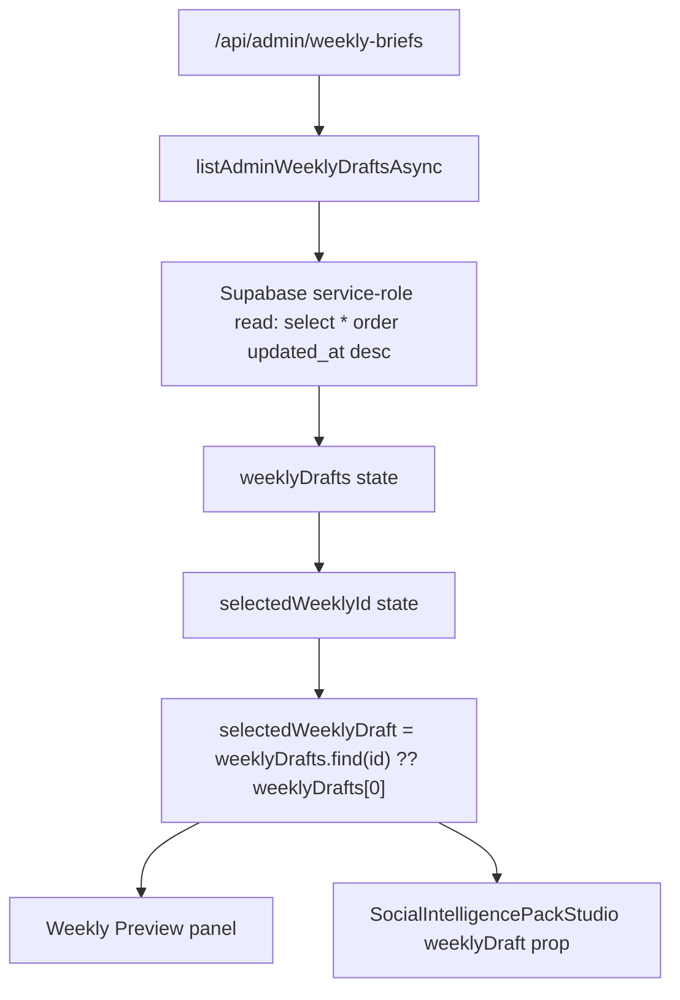
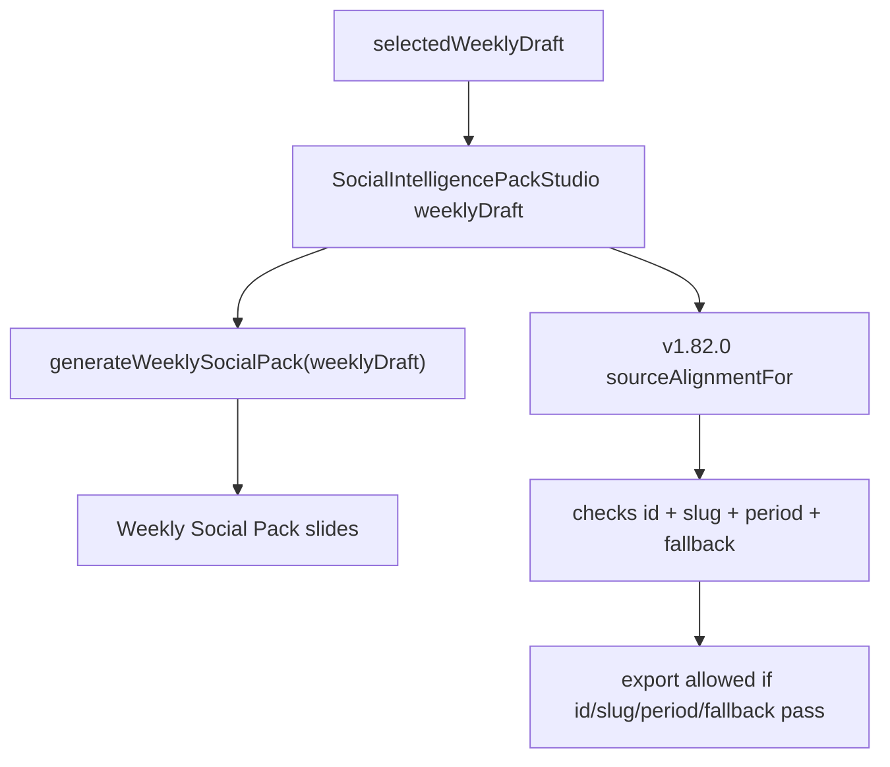
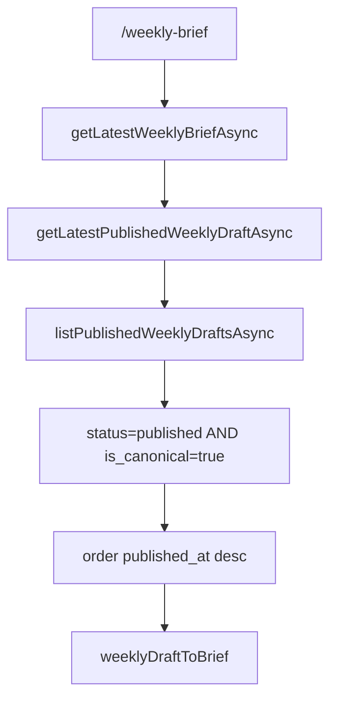

# v1.82.2 — Weekly Social Pack Revision Alignment Audit

## Incident Summary

v1.82.0 fixed the Daily / Weekly period source guard. Weekly Social Pack can no longer silently use Daily fallback content when no Weekly source exists.

After v1.82.1 row diagnostics, the remaining symptom is narrower:

- Public Weekly Brief reads canonical published `weekly-intelligence-2026-06-07-r3`.
- Supabase row diagnostics showed `weekly-intelligence-2026-06-07-r4` exists as `review` and `is_canonical=false`.
- Weekly Social Pack visually appears closer to the review revision than to the public Weekly Brief.

The likely issue is no longer cross-period mapping. It is revision/status alignment: Weekly Social Pack can use the currently selected admin review draft instead of the public canonical published Weekly source.

## Evidence From Screenshots / User Observation

User-observed evidence:

- Public Weekly Brief content corresponds to `r3`.
- Weekly Social Pack content appears closer to `r4` or another non-published source.
- The mismatch remains after v1.82.0 period guard, which suggests Daily-vs-Weekly period alignment is no longer the primary fault.

Code evidence:

- Admin Weekly history includes draft, review, published, and archived rows.
- Admin selection is arbitrary / operator-driven: clicking any row sets `selectedWeeklyId`.
- Weekly Preview renders `selectedWeeklyDraft`.
- Social Pack Studio receives `weeklyDraft={selectedWeeklyDraft}`.
- v1.82.0 source guard checks matching period, id, slug, and fallback state, but does not require Weekly `status === "published"` or `isCanonical === true`.

## Files Audited

- `components/admin/daily-briefs-admin.tsx`
- `components/admin/social-intelligence-pack-studio.tsx`
- `app/admin/daily-briefs/page.tsx`
- `app/api/admin/weekly-briefs/route.ts`
- `app/api/admin/weekly-briefs/generate/route.ts`
- `app/api/admin/weekly-briefs/[id]/publish/route.ts`
- `app/api/admin/weekly-briefs/[id]/route.ts`
- `app/api/weekly-briefs/latest/route.ts`
- `app/api/weekly-briefs/[slug]/route.ts`
- `src/lib/editorial/weekly.ts`
- `src/lib/weeklyBriefs.ts`
- `src/lib/intelligence/social/social-intelligence-pack.ts`
- `components/admin/social-intelligence-pack-studio.tsx`

Repo search terms included:

- `weeklyDraft`
- `selectedWeekly`
- `activeWeekly`
- `latestWeekly`
- `weeklyDrafts`
- `review`
- `published`
- `isCanonical`
- `is_canonical`
- `revisionNumber`
- `revision_number`
- `sourceStatus`
- `sourceSlug`
- `sourceId`
- `SocialIntelligencePackStudio`
- `weekly social`
- `buildWeekly`
- `generateWeeklySocial`
- `weekly pack`
- `fallback`
- `preview`

## Admin Weekly Selection Flow



Findings:

- `listAdminWeeklyDraftsAsync()` intentionally returns durable admin rows only, including `draft`, `review`, `published`, and `archived`.
- Admin list order is `updated_at.desc`, then local `sortWeeklyDrafts()` also sorts by `publishedAt ?? updatedAt ?? generatedAt ?? weekEnd`.
- The first selected row defaults to `weeklyDrafts[0]` when no explicit selection exists.
- If review `r4` was updated after published canonical `r3`, the default admin selection can become `r4`.
- Clicking any row in Weekly Draft History directly sets `selectedWeeklyId`.
- Weekly Preview panel displays the selected row, not necessarily public canonical latest.
- Social Pack Studio receives the same selected row.

Conclusion:

Admin Weekly selection is not equivalent to public Weekly readback. It is an editorial workspace selection.

## Weekly Social Pack Source Flow



Findings:

- Weekly Social Pack uses the exact `selectedWeeklyDraft` passed by the admin Weekly desk.
- The generator does not fetch public latest canonical Weekly.
- v1.82.0 source metadata displays:
  - source period
  - source slug
  - source title
  - source date
  - source status
  - fallback state
- v1.82.0 export eligibility does not yet inspect:
  - `weeklyDraft.status`
  - `weeklyDraft.isCanonical`
  - `weeklyDraft.revisionNumber`
  - whether `weeklyDraft.slug` equals public latest canonical slug

Therefore a Weekly review draft such as `weekly-intelligence-2026-06-07-r4` can be a valid period-aligned source and still be non-public.

## Public Weekly Source Flow



Findings:

- Public Weekly Brief uses the published canonical path.
- With revision schema available, public latest requires `status=published` and `is_canonical=true`.
- Public detail also requires exact slug plus `status=published` and `is_canonical=true`.
- Public Weekly does not read review `r4`.

Conclusion:

Public Weekly and Admin Weekly Social Pack can legitimately point at different rows under the current admin architecture.

## Source Mismatch Hypothesis

Hypothesis:

```text
Public Weekly Brief
→ r3
→ status=published
→ is_canonical=true

Admin selected Weekly draft
→ r4
→ status=review
→ is_canonical=false

Weekly Social Pack
→ generated from selectedWeeklyDraft
→ r4 review source
→ content differs from public Weekly r3
```

Code support:

- Strongly supported.
- `selectedWeeklyDraft` directly feeds `SocialIntelligencePackStudio`.
- `generateWeeklySocialPack()` uses the passed source object without canonical lookup.
- v1.82.0 export guard does not block review/non-canonical Weekly drafts.

Data confirmation still needed:

- Confirm the current admin-selected row in the UI is r4.
- Confirm the Weekly Social Pack metadata displays source slug `weekly-intelligence-2026-06-07-r4`, source status `review`, and fallback `false`.

## Confirmed

- Admin Weekly list includes non-published rows.
- Admin Weekly Preview uses selected row.
- Weekly Social Pack Studio receives selected row.
- Public Weekly Brief uses canonical published row.
- v1.82.0 guard prevents period fallback export but does not prevent non-published Weekly revision export.

## Not Confirmed

- It is not directly confirmed in code alone that the user's specific screenshot selected r4.
- It is not confirmed that r4 content exactly matches the observed Weekly Social Pack text without viewing the live admin state.
- It is not confirmed that public Weekly r3 and admin selected r4 are both visible in the same browser session.

## Recommended Product Rule

Recommendation: combine Option A and Option B.

### Option A — Formal export source

Formal Weekly Social Pack export must use only:

- `source.status === "published"`
- `source.isCanonical === true`
- exact canonical published slug
- same week range

This keeps public Weekly Brief and exported Weekly Social Pack aligned.

### Option B — Review preview source

Admin may preview a selected review draft, but the preview must be clearly marked:

- `Review preview only`
- `Not canonical`
- `Not published`
- export/download/copy disabled

### Option C — Admin source switch

Optional future enhancement:

- Admin can switch between:
  - Public canonical source
  - Selected review draft preview
- Export remains enabled only for public canonical source.

## Safe Fix Plan

Recommended next version:

`v1.82.3 — Weekly Social Pack Canonical Export Guard`

Small safe fix:

1. Extend `sourceAlignmentFor()` in `components/admin/social-intelligence-pack-studio.tsx`.
2. For `kind === "weekly"`, require:
   - `weeklyDraft.status === "published"`
   - `weeklyDraft.isCanonical === true`
3. If Weekly source is `review`, `draft`, `archived`, or non-canonical:
   - allow preview
   - disable export/download/copy
   - show warning:
     `此 Weekly Social Pack 來源不是 published canonical weekly，僅可預覽，不可匯出。`
4. Add metadata:
   - source revision
   - source canonical true/false
   - public export eligible true/false
5. Do not change public weekly readback.
6. Do not change generator logic.
7. Do not change Supabase schema or data.

Optional later fix:

- Fetch latest public canonical weekly in admin and show it beside selected draft:
  - public canonical slug
  - selected draft slug
  - mismatch warning

## No-Touch Areas

Do not modify:

- v1.80 / v1.81 Portfolio / FCN / Stock / Crypto files.
- Supabase schema or migrations.
- Weekly generator large logic.
- Public Weekly readback.
- Auth / SSO / Pro launch.
- Backend account-link.
- LINE / LIFF.
- Stripe / billing.

## Go / No-Go

Go for a small v1.82.3 code fix.

Reason:

- The current behavior is code-supported and reproducible by design: admin selected review draft can feed Weekly Social Pack export.
- The fix can be restricted to Social Pack Studio export eligibility.
- It does not require DB changes or generator changes.

## Next Recommended Version

`v1.82.3 — Weekly Social Pack Canonical Export Guard`

Goal:

- Keep review Weekly Social Pack preview possible.
- Require published canonical Weekly source for export/download/caption copy.
- Show revision/status/canonical metadata in Social Pack Studio.
