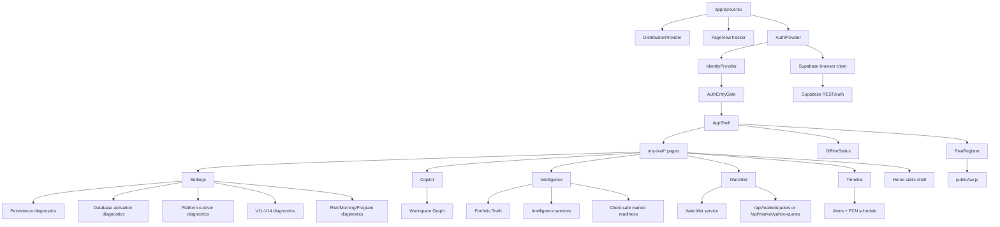

# Workspace Runtime Audit - 2026-06-27

## Executive Summary

This audit investigated the Workspace runtime crash pattern without changing product code.

The strongest finding is not a remaining direct Yahoo CORS path. Existing browser bundles under `.next/static` contain internal quote route references such as `/api/market/yahoo-quotes` and `/api/market/quotes`, but no direct `query1.finance.yahoo.com`, `https://query1.finance.yahoo.com`, `yahoo-quote-provider`, or `fetchYahooEquityQuote` matches.

The highest-risk runtime pattern is repeated uncaught async work in client components. Many Workspace pages schedule async loaders with `queueMicrotask(() => void refresh())` or `void promise.then(...)` and do not attach rejection handlers at the component boundary. When any downstream Supabase/auth/storage/network path rejects, Chrome reports `Uncaught (in promise)`. Settings is the densest affected page because it mounts many diagnostic cards, each fanning out into large `Promise.all(...)` trees.

I did not find a clear synchronous infinite React render loop. The crash profile is more consistent with long-lived promise churn, Supabase auth refresh/session failure paths, and uncaught one-shot or event-triggered async diagnostics accumulating over time. Watchlist has intentional 60-second polling through `useLiveResource`; that hook catches fetch failures, aborts on unmount, and pauses while hidden, so it is a load source but not the top runaway candidate.

## Runtime Dependency Graph

Key persistence rule from the local Next docs: App Router layouts persist across navigation. Because `AuthProvider`, `IdentityProvider`, `AppShell`, PWA registration, and analytics live in the root layout, their effects are long-lived across Workspace pages.

## Service Worker Findings

- `components/pwa/pwa-register.tsx` registers the service worker only in production and skips admin paths. Registration is idempotent per in-flight call, but `registrationInFlight` is reset after a zero-delay timeout, so later route changes can retry registration.
- `public/sw.js` has no explicit retry loop. It handles install, activate, fetch, push, and notification click.
- The service worker excludes many sensitive/API paths, including `/api/auth`, `/api/market`, `/api/daily-briefs`, and Supabase-keyword paths. Excluded GETs are passed through as `event.respondWith(fetch(request))`.
- Static asset caching writes `caches.open(...).then(cache.put(...))` without awaiting/catching that cache write. That is a possible service-worker-side rejected promise if Cache Storage fails, but it is not obviously tied to the Workspace-only crash.
- Navigation requests catch fetch failures and return an offline HTML shell.
- No service worker retry storm was identified.

## Promise Audit

High-risk unhandled promise call sites:

- `components/auth/auth-provider.tsx:168` calls `void hydrateIdentity()` without `.catch(...)`.
- `components/auth/auth-provider.tsx:177` calls `void activateAuthenticatedSession(nextSession)` from `onAuthStateChange` without `.catch(...)`.
- `components/auth/auth-provider.tsx:203` calls `void saveProfileMemory(...).then(...)` without `.catch(...)`.
- `components/auth/auth-provider.tsx:295`, `:298`, and `:309` use the same `.then(...)` pattern for preference/profile saves.
- `components/workspace/workspace-database-activation-status.tsx:50-92` runs a large `Promise.all(...)`; mount calls it at `:386` via `queueMicrotask(() => void refresh())` with no catch.
- `components/workspace/workspace-platform-cutover-status.tsx:42-51` runs a `Promise.all(...)`; mount calls it at `:62` without catch.
- `components/workspace/workspace-v11-database-activation-status.tsx:26-31` runs a `Promise.all(...)`; mount calls it at `:38` without catch.
- `components/workspace/workspace-v12-database-write-activation-status.tsx`, `workspace-v13-portfolio-database-write-activation-status.tsx`, and `workspace-v14-fcn-database-activation-status.tsx` follow the same uncaught `queueMicrotask(() => void refresh())` pattern.
- `components/watchlist/watchlist-summary.tsx`, `components/copilot/workspace-copilot-summary.tsx`, and `components/workspace/workspace-timeline-summary.tsx` also call async `refresh()` via `queueMicrotask(() => void refresh())` without local catch, although their services are more defensive.
- `components/intelligence/intelligence-v2-summary.tsx` uses `void getWorkspaceIntelligenceV2Report().then(...)` without `.catch(...)`.
- `components/intelligence/intelligence-center-workspace.tsx` wraps no catch around its initial `loadIntelligenceCenter()` call. It awaits `loadPortfolioTruthReadback()`, which catches common API failures, but the component boundary still assumes no unexpected rejection.

Lower-risk defensive patterns:

- `src/hooks/use-live-resource.ts` catches fetcher errors, aborts on unmount, serializes in-flight work, and schedules the next refresh in `finally`.
- `components/risk/legacy-risk-engine-status.tsx`, `components/morning-brief/morning-brief-status.tsx`, `components/intelligence/intelligence-summary.tsx`, and `components/insights/workspace-insights-summary.tsx` catch loader failures internally.
- Many Supabase REST helper functions catch `fetch` failures and return fallback statuses.

## useEffect Audit

Persistent root effects:

- `AuthProvider` has a mount hydration/auth-listener effect and a memory persistence effect. These run across all Workspace pages because they are mounted in the root layout.
- `IdentityProvider` calls `/api/auth/me` once after mount and exposes a manual `refresh()`.
- `PageViewTracker` registers analytics once, tracks page changes, and adds scroll listeners only on article paths.
- `AppShell` mounts `PwaRegister` and `OfflineStatus` across non-admin pages.

Workspace page effects:

- Settings mounts the largest number of client effects. Many diagnostic cards start async refreshes immediately on mount.
- Copilot and Timeline each run one async refresh on mount.
- Intelligence runs multiple async loaders on mount: `IntelligenceCenterWorkspace`, `IntelligenceSummary`, and `IntelligenceV2Summary`.
- Watchlist Center uses `WatchlistSummary`, which does a one-shot async refresh. The legacy `/watchlist` manager uses `useLiveResource` polling every 60 seconds.
- Home is mostly static and explicitly avoids background fetches in the current shell.

No effect was found that directly sets one of its own dependencies every render in a tight synchronous loop. The main risk is uncaught async work and repeated event/auth/timer entry points.

## Provider Audit

Root providers:

- `DistributionProvider`: low risk; captures attribution into sessionStorage once.
- `PageViewTracker`: low risk for Workspace routes; no read-depth scroll listener unless article paths.
- `AuthProvider`: highest provider risk. It creates the Supabase browser client with `autoRefreshToken: true`, subscribes to auth state changes, performs profile/preference persistence, and uses several `void` async calls without catch.
- `IdentityProvider`: moderate risk. Its `/api/auth/me` refresh has try/catch, but it remains another root-level auth consumer.

Market/data providers:

- Direct Yahoo provider code still exists in server/library paths, including `src/lib/market-data/yahoo/yahoo-quote-provider.ts` and `src/lib/market/providers/yahoo-finance.ts`.
- Browser bundle evidence did not show direct Yahoo endpoint/provider strings. Client-facing quote paths use internal API routes.
- `WorkspaceMarketStatus` is readiness-only and does not fetch quotes.

## Context Audit

- `AuthProvider` defines a context named `IdentityContext` for the full IXAI session/memory model.
- `IdentityProvider` separately defines another `IdentityContext` for lightweight membership/session state. The naming overlap is confusing but not itself a runtime loop.
- Both contexts are mounted globally in `app/layout.tsx`. Failures in either affect all Workspace pages.
- `AuthEntryGate` uses `useIdentity()` from `AuthProvider`; protected Workspace pages depend on `mounted` and `session.mode` before rendering.

## Retry Loop Audit

Identified retry or repeated-work mechanisms:

- Supabase auth client is configured with `autoRefreshToken: true`. This is a necessary auth feature but is a top suspect if invalid/expired session data causes repeated auth refresh failures or rejected promises.
- `useLiveResource` schedules refreshes with `setTimeout`, not `setInterval`, and prevents overlapping in-flight calls.
- Watchlist quote refresh interval is 60 seconds and pauses while hidden.
- PWA registration can retry after route/path changes because `registrationInFlight` is reset after a tick, but it catches registration failures.
- Service worker has no explicit retry loop.
- Settings diagnostic refreshes are mostly one-shot on mount, plus manual refresh buttons and V13/V14 event listeners.

No `setInterval(...)` use was found in app/components/src runtime files.

## Top 10 Runtime Risks

1. Root `AuthProvider` unhandled promises around hydration, auth-state activation, and profile persistence. Confidence: high.
2. Supabase auto-refresh/session lifecycle interacting with invalid, expired, or 401-producing session state. Confidence: medium-high.
3. Settings diagnostic fan-out: many uncaught `queueMicrotask(() => void refresh())` calls and large `Promise.all(...)` trees. Confidence: high for unhandled rejections, medium for eventual crash.
4. Diagnostic components leave `isLoading` stuck if an uncaught rejection occurs before `setIsLoading(false)`. Confidence: high.
5. `Promise.all(...)` fail-fast behavior in Settings diagnostics means one unexpected rejection discards all other safe fallbacks. Confidence: medium-high.
6. Event-driven diagnostics for V13/V14 attach refresh functions directly to window events; failures from event-triggered refreshes are not caught. Confidence: medium.
7. Service worker excluded fetch pass-through can reject without fallback for non-navigation requests. Confidence: medium-low.
8. Browser bundle contains Supabase REST/auth code and direct Supabase client persistence paths; 401s should degrade gracefully but not every caller has a catch. Confidence: medium.
9. Multiple client services are marked `"use client"` while importing broad workspace graph modules, increasing browser bundle size and the amount of browser-side async work. Confidence: medium.
10. Context naming collision between two separate `IdentityContext`s increases maintenance risk around auth flows. Confidence: low for crash, medium for future regression.

## Top 3 Root Causes

1. Unhandled promise boundaries in long-lived auth/persistence paths.
   - Evidence: `AuthProvider` uses `void hydrateIdentity()`, `void activateAuthenticatedSession(...)`, and `void saveProfileMemory(...).then(...)` without catch.
   - Why it matches symptoms: a rejected auth/session/storage/Supabase promise becomes `Uncaught (in promise)` globally and affects all Workspace pages because the provider persists in the root layout.

2. Uncaught diagnostic fan-out on Settings and related Workspace cards.
   - Evidence: Settings diagnostics use large `Promise.all(...)` refreshes and call them through `queueMicrotask(() => void refresh())` without catch.
   - Why it matches symptoms: one unexpected rejection per mounted card can produce repeated unhandled promise messages, leave loading state stuck, and compound with manual refresh/event refreshes.

3. Supabase 401/session refresh paths are fallback-safe in many helpers but not guaranteed at every caller boundary.
   - Evidence: most REST helpers catch `fetch` failures, but root auth/session helpers and component-level `void` calls do not universally catch. Browser bundles include Supabase auth/REST code.
   - Why it matches symptoms: 401s may not crash through business helpers, but rejected auth client promises or unexpected storage/session failures can still surface as global promise rejections.

## Recommended Fix Order

1. Add catch/finally boundaries to every root provider async path, starting with `AuthProvider` hydration, auth-state activation, sign-out task, and persistence saves.
2. Wrap every `queueMicrotask(() => void refresh())` loader with a local `try/catch/finally` or `void refresh().catch(...)`, especially Settings diagnostics.
3. Convert Settings diagnostic `Promise.all(...)` calls to `Promise.allSettled(...)` or per-module safe readers so one module cannot reject the entire card.
4. Add a single reusable `runClientRefresh` or `safeClientEffect` helper for one-shot client effects, with mounted guards and rejection logging.
5. Audit Supabase auth/session helpers so `getSession()`, `getSupabaseAccessToken()`, and profile/bootstrap paths never reject to callers on 401, invalid refresh token, storage failure, or network failure.
6. Add production-only global instrumentation for `window.unhandledrejection` and `window.error` to capture reason, route, component label, and count without crashing the UI.
7. Keep Yahoo provider code server/API-only; add a build check that fails if direct Yahoo endpoints appear under `.next/static`.
8. Re-run long-idle browser validation on Settings, Copilot, Intelligence, Watchlist, Timeline, and Home after fixes.

## Validation Evidence

- Read local Next docs under `node_modules/next/dist/docs/01-app/index.md` and `04-glossary.md`; relevant behavior: App Router layouts persist and client bundles follow the module graph.
- Inspected root layout: `app/layout.tsx` mounts `DistributionProvider`, `PageViewTracker`, `AuthProvider`, `IdentityProvider`, `AuthEntryGate`, and `AppShell`.
- Inspected service worker and registration: `components/pwa/pwa-register.tsx`, `src/lib/pwa/register-sw.ts`, and `public/sw.js`.
- Inspected affected pages and mounted Workspace components: Settings, Copilot, Home, Intelligence, Watchlist, Timeline.
- Ran source scans for `useEffect`, `fetch`, `Promise`, retry/timer APIs, router APIs, event listeners, localStorage, Supabase, and Yahoo references.
- Ran bundle scan against `.next/static`:
  - No files matched direct Yahoo endpoint/provider strings: `query1.finance.yahoo`, `https://query1.finance.yahoo`, `yahoo-quote-provider`, `fetchYahooEquityQuote`.
  - Internal quote route strings were present: `/api/market/yahoo-quotes` and `/api/market/quotes`.
  - Supabase auth/REST strings were present, including `/rest/v1`, `createClient`, `autoRefreshToken`, and `supabase`.
- Confirmed no `setInterval(...)` occurrences in `app`, `components`, or `src` runtime files.
- Confirmed `useLiveResource` has cleanup, abort, in-flight guard, error catch, and hidden-tab pause.
- Confirmed service worker contains no explicit retry loop.
